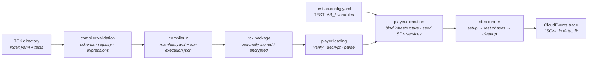
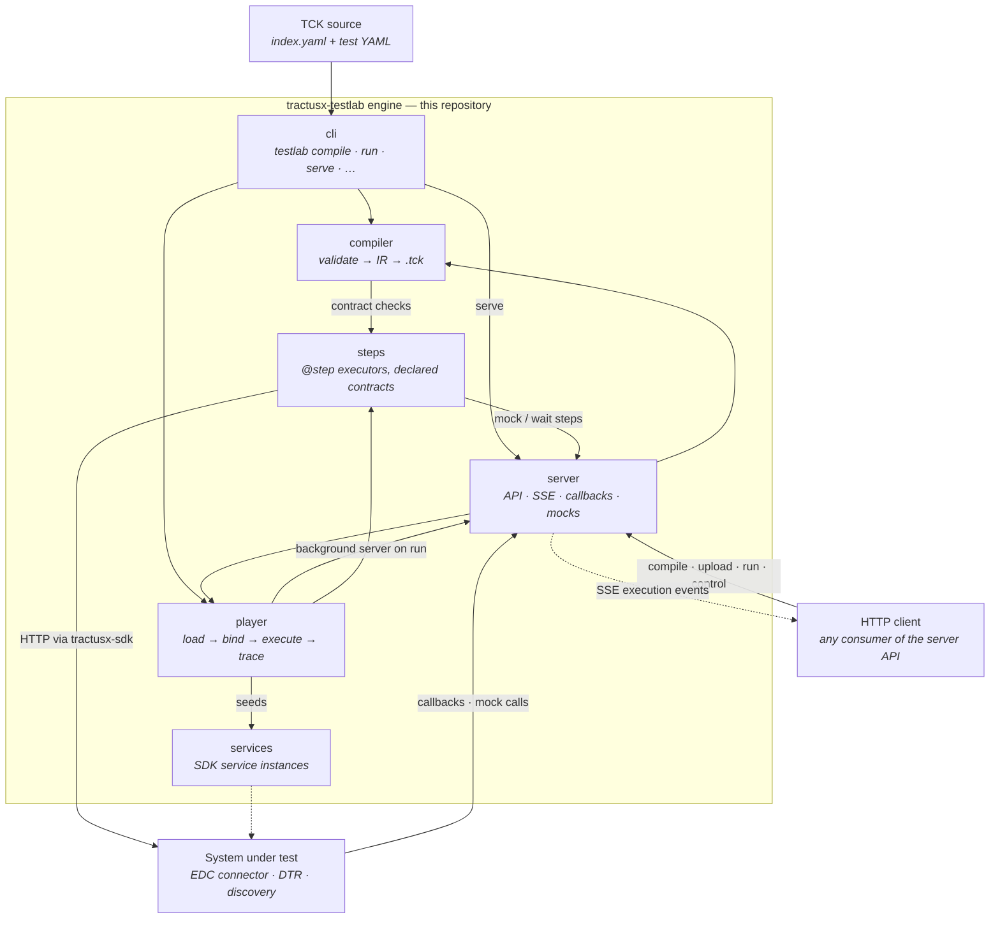

<!--
 Eclipse Tractus-X - Tractus-X TestLab

 Copyright (c) 2026 Contributors to the Eclipse Foundation

 See the NOTICE file(s) distributed with this work for additional
 information regarding copyright ownership.

 This program and the accompanying materials are made available under the
 terms of the Apache License, Version 2.0 which is available at
 https://www.apache.org/licenses/LICENSE-2.0.

 Unless required by applicable law or agreed to in writing, software
 distributed under the License is distributed on an "AS IS" BASIS, WITHOUT
 WARRANTIES OR CONDITIONS OF ANY KIND, either express or implied. See the
 License for the specific language governing permissions and limitations
 under the License.

 SPDX-License-Identifier: Apache-2.0
-->
<!-- This code was partially generated using artificial intelligence (AI) (Tool: Copilot, Model: Claude Opus 4.6). -->
<!-- It was reviewed and tested by a human committer. -->

# Architecture

## Overview

This repository is the **TestLab engine**: a Python library, the `testlab` CLI, and a
FastAPI server. It validates TCKs, seals them into `.tck` packages, and executes them
against a system under test (SUT). There is no user interface in this repository — the
YAML test files are the interface, and any text editor produces them.

The engine has four run-time roles:

1. **Compiler** — validates a TCK manifest and its tests against the JSON schemas and the
   step registry, builds the execution IR, and writes a `.tck` package, optionally signed
   and encrypted for named players.
2. **Player** — loads a `.tck` package (verifying and decrypting it), binds the
   infrastructure the operator configured, seeds the SDK services, and runs the steps,
   writing a CloudEvents execution trace.
3. **Steps** — the `@step` executors a test names in `uses:`. Each declares its inputs and
   outputs as Pydantic models and reaches the dataspace through `tractusx-sdk`.
4. **Server** — hosts the HTTP API (compile, package storage, runs, job control, SSE
   event stream), the callback endpoints, and the mock endpoints tests open for the SUT.

The server runs in two ways: standalone with `testlab serve`, or started by the player in
a background thread during `testlab run`, so that mocks and callbacks work from the CLI
too.

## Module organization — deep modularity

The engine (`src/tractusx_testlab/`) follows one organizing principle: **deep
modularity**. The architecture is not "files split when they exceed 300 lines"; it
is a tree in which **every concern is a module in its own right**.

A module — a Python package — has exactly three properties:

1. **A single nameable responsibility.** If you cannot name what it does without
   the word "and", it is more than one module.
2. **Its own barrel** as the public surface — the `__init__.py`. The barrel
   re-exports the module's public API and contains no logic.
3. **A minimal public surface.** Private helpers (`_*.py`) stay internal and are
   never imported across module boundaries.

Modules **nest as deep as real responsibility seams require** — sub-modules within
sub-modules. Parent barrels re-export through their child barrels, so external
consumers import the **parent only** and never reach into a deep path. Inside the
same area, mutually-referencing modules use **direct relative paths** (not the
sibling barrel) to avoid barrel-evaluation cycles.

### When a module is needed

The 300-line limit is **one trigger among several** — the loudest, but the last to
rely on. Any one of these signals a missing module:

| Trigger | Meaning |
|---------|---------|
| Bundled responsibilities | One file does loading *and* transforming *and* validating — three modules wearing one filename, even under 300 lines. |
| Flat folder of mixed concerns | A folder is a dump of siblings that cluster into distinct sub-concerns. |
| Duplication | The same logic appears twice — extract it into one importable module. |
| Size > 300 lines | The loudest trigger; by the time a file is oversized the seams are already obvious. |

### Guardrail — no over-engineering

Nest **only** where a real, nameable seam exists. Never create a single-function
"module" just to add depth, never split a cohesive unit, and never invent a folder
holding one stray file with no sibling concern. The boring, readable structure a
human can navigate always wins over artificial depth.

This is a **behavior-preserving** discipline: modularization changes structure
only — never runtime behavior, generated output, or any
observable contract.

### Engine layers (`src/tractusx_testlab/`)

The runtime imports between the top-level packages are:

```
syntax, models, contracts   leaves: no imports from other testlab packages
infrastructure ─▶ models, syntax
config         ─▶ infrastructure, models
security       ─▶ models
logging        ─▶ models
services       ─▶ models, syntax                          (SDK service wiring)
authoring      ─▶ models, syntax, steps                   (registry, parser, step docs)
steps          ─▶ authoring, logging, models, syntax, server.mock_registry
compiler       ─▶ authoring, infrastructure, models, steps, syntax
player         ─▶ authoring, compiler, config, contracts, infrastructure,
                  logging, models, security, server, services, steps, syntax
server         ─▶ authoring, compiler, config, models, player, syntax
cli            ─▶ authoring, compiler, config, infrastructure, logging,
                  models, player, security, syntax        (`serve` loads server by import string)
```

Steps refer to `StepContext` from `player` only under `TYPE_CHECKING`. The graph has two
cycles that the code resolves with deferred imports:

- `authoring` ↔ `steps` — steps register through `authoring.registry.step`, and the step
  reference renderer in `authoring` reads `BaseStep` contracts.
- `player` ↔ `server` — the server app owns a `TestlabPlayer`, and the player uses the
  callback manager and mock registry and starts the app in-process for CLI runs.

`steps/` is the keystone: the compiler imports it to check `uses:`, `with:`, `returns:` and
`validate:` against the declared contracts, and the player imports it to execute.

```
src/tractusx_testlab/
  authoring/       step registry (@step), YAML parser, Tck/Test object model, step reference renderer
  cli/             Typer commands: compile, validate, inspect, run, serve, docs, schema, keygen, config
  compiler/        YAML → IR (ir/) → validation (validation/) → .tck package; JSON schemas (schemas/)
  config/          TestlabConfig settings and loading (file + TESTLAB_* environment)
  contracts/       Protocols stating what the engine requires of SDK services
  infrastructure/  typed infrastructure bindings (sut / engine sides) and their config, env and ${{ }} forms
  logging/         console transcript, structured logging, CloudEvents trace, wire recording (wire/)
  models/          Pydantic data only — authoring/, domain/, primitives/, runtime/
  player/          loading/ (.tck → Tck) → execution/ (bind, seed, run, trace) → jobs
  schemas/         packaged JSON-schema assets (data, no code)
  security/        crypto/ (keygen, signing, encryption) + trust/ (identity, trust store, vault)
  server/          FastAPI app: routes/ (jobs, compile, callbacks), streaming/ (SSE), mock registry
  services/        SDK service instances and their lifecycle (no protocol reimplementation)
  steps/           step executors, one domain per sub-package (connector/, digital_twin_registry/, mock/, …)
  syntax/          leaf: syntax keys, defaults, patterns and author-facing diagnostics
```

Each package nests further along its seams — e.g. `steps/connector/` nests `provision/`,
`compiler/` nests `ir/` and `validation/`, `player/` nests `loading/` and `execution/`.

## Compile and run flow



`testlab validate` stops after validation, `testlab compile` writes the package,
`testlab inspect` reads one back without executing it, and `testlab run` loads and executes
it. Over HTTP the same flow is `POST /testlab/compile`, `POST /testlab/packages`, and
`POST /testlab/run/package`.

## System diagram



## Server API

All named routes live under `/testlab`; the catch-all route that serves mock endpoints is
registered last so it never shadows them.

| Route | Purpose |
|---|---|
| `GET /testlab/health` | Status and installed engine version |
| `POST /testlab/compile` | Validate and compile a TCK sent in the request |
| `POST /testlab/packages` · `GET /testlab/packages` · `DELETE /testlab/packages/{package_id}` | Package storage |
| `POST /testlab/run/package` | Run a stored or uploaded package as a job |
| `POST /testlab/tck-execution/run` · `POST /testlab/tck-execution/run/yaml` | Start a run from a TCK sent in the request |
| `GET /testlab/tck-execution/{job_id}/stream` | SSE stream of the job's execution events (resumable via `Last-Event-ID`) |
| `GET /testlab/tck-execution` · `GET /testlab/tck-execution/{job_id}` | List jobs, read one job |
| `POST /testlab/tck-execution/{job_id}/cancel` · `/pause` · `/resume` | Job control |
| `/testlab/callbacks/{path}` | Callback endpoints a test listens on |
| `/{path}` | Mock endpoints opened by `mock/*` steps; unregistered paths return 404 |

The step reference (`testlab docs`) and the JSON schemas (`testlab schema`) are generated
from the step contracts and authoring models, so the published reference cannot drift from
the code.
