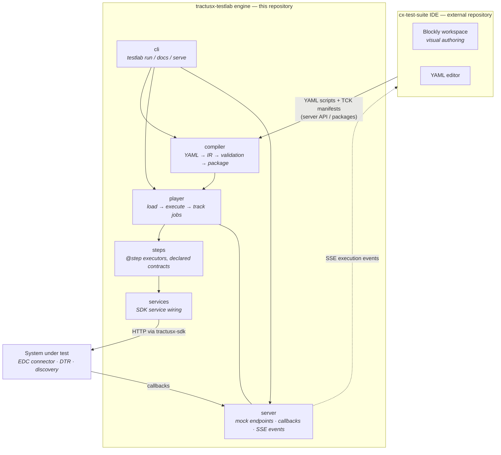

<!--
 Eclipse Tractus-X - Tractus-X TestLab

 Copyright (c) 2026 Contributors to the Eclipse Foundation

 See the NOTICE file(s) distributed with this work for additional
 information regarding copyright ownership.

 This program and the accompanying materials are made available under the
 terms of the Apache License, Version 2.0 which is available at
 https://www.apache.org/licenses/LICENSE-2.0.

 Unless required by applicable law or agreed to in writing, software
 distributed under the License is distributed on an "AS IS" BASIS, WITHOUT
 WARRANTIES OR CONDITIONS OF ANY KIND, either express or implied. See the
 License for the specific language governing permissions and limitations
 under the License.

 SPDX-License-Identifier: Apache-2.0
-->
<!-- This code was partially generated using artificial intelligence (AI) (Tool: Copilot, Model: Claude Opus 4.6). -->
<!-- It was reviewed and tested by a human committer. -->

# Architecture

## Overview

This repository contains the **TestLab engine**: the Python library, CLI, and server that compile YAML test scripts into executable packages and run them against a system under test. The engine has three run-time roles:

1. **Compiler** — validates YAML scripts and TCK manifests and packages them
2. **Player** — loads a package and executes its steps against the SUT
3. **Server** — hosts mock endpoints, callbacks, and streams execution events (SSE)

The **IDE frontend** — the browser-based visual authoring tool (React + Blockly) — lives in the separate **cx-test-suite** repository. It communicates with this engine via the server API and consumes the block catalog generated from the engine's step registry; the YAML it emits is exactly what the compiler here accepts.

## Module organization — deep modularity

The engine (`src/tractusx_testlab/`) follows one organizing principle: **deep
modularity**. The architecture is not "files split when they exceed 300 lines"; it
is a tree in which **every concern is a module in its own right**.

A module — a Python package — has exactly three properties:

1. **A single nameable responsibility.** If you cannot name what it does without
   the word "and", it is more than one module.
2. **Its own barrel** as the public surface — the `__init__.py`. The barrel
   re-exports the module's public API and contains no logic.
3. **A minimal public surface.** Private helpers (`_*.py`) stay internal and are
   never imported across module boundaries.

Modules **nest as deep as real responsibility seams require** — sub-modules within
sub-modules. Parent barrels re-export through their child barrels, so external
consumers import the **parent only** and never reach into a deep path. Inside the
same area, mutually-referencing modules use **direct relative paths** (not the
sibling barrel) to avoid barrel-evaluation cycles.

### When a module is needed

The 300-line limit is **one trigger among several** — the loudest, but the last to
rely on. Any one of these signals a missing module:

| Trigger | Meaning |
|---------|---------|
| Bundled responsibilities | One file does loading *and* transforming *and* validating — three modules wearing one filename, even under 300 lines. |
| Flat folder of mixed concerns | A folder is a dump of siblings that cluster into distinct sub-concerns. |
| Duplication | The same logic appears twice — extract it into one importable module. |
| Size > 300 lines | The loudest trigger; by the time a file is oversized the seams are already obvious. |

### Guardrail — no over-engineering

Nest **only** where a real, nameable seam exists. Never create a single-function
"module" just to add depth, never split a cohesive unit, and never invent a folder
holding one stray file with no sibling concern. The boring, readable structure a
human can navigate always wins over artificial depth.

This is a **behavior-preserving** discipline: modularization changes structure
only — never runtime behavior, generated output (YAML ), or any
observable contract.

### Engine layers (`src/tractusx_testlab/`)

The engine is layered. Inner layers never import outer ones:

```
syntax  ──▶  (leaf: pure constants, no testlab imports)
models  ──▶  syntax
config  ──▶  models, syntax
security ─▶  models
services ─▶  models, config, security        (SDK service wiring)
steps   ──▶  models, services, syntax, config (never imports player/server/cli)
compiler ─▶  models, syntax, steps (registry only)
player  ──▶  steps, services, models, config, compiler
server  ──▶  player, compiler, services, models
cli     ──▶  compiler, player, server, config   (thinnest layer, top of stack)
```

`steps/` is the keystone: it depends downward on `models`/`services`/`syntax` and
is imported upward by `compiler` (for `@step` registry validation) and `player`
(for execution).

```
src/tractusx_testlab/
  cli/        Typer command groups — thin; delegate, never compute
  compiler/   compile-time: YAML → IR (ir/) → validation (validation/) → package
  config/     configuration loading & settings (data + I/O only)
  logging/    structured logging, transcript and wire recording — cross-cutting
  models/     Pydantic data only — no behavior, no I/O
  player/     run-time: load (loading/) → execute (execution/) → track jobs
  scripting/  script object model + builder DSL (author-facing)
  security/   crypto (crypto/) + identity & trust (trust/)
  server/     FastAPI mock server: routes (routes/) + SSE streaming (streaming/)
  services/   SDK service wiring + lifecycle (no protocol reimplementation)
  steps/      step executors — one domain per sub-package (connector/, industry/, …)
  syntax/     leaf: syntax constants + author-facing diagnostics — no testlab imports
  schemas/    packaged JSON-schema assets (data, no code)
```

Each layer nests further along its seams — e.g. `steps/connector/` holds the
EDC/DSP domain steps and nests a `dsp/` sub-package (one protocol verb per file);
`compiler/` nests `ir/` and `validation/` sub-packages. For the complete nested
end-state tree see
[refactor-plan/backend-refactor-plan.md](refactor-plan/backend-refactor-plan.md) §2.

## System diagram



The engine also generates the artefacts the IDE consumes: the step reference (`testlab docs`) and the block catalog that mirrors the step registry, kept in sync by the parity checker (`tools/compare_ide_parity.py`).
