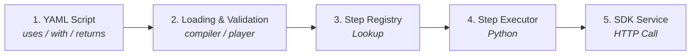
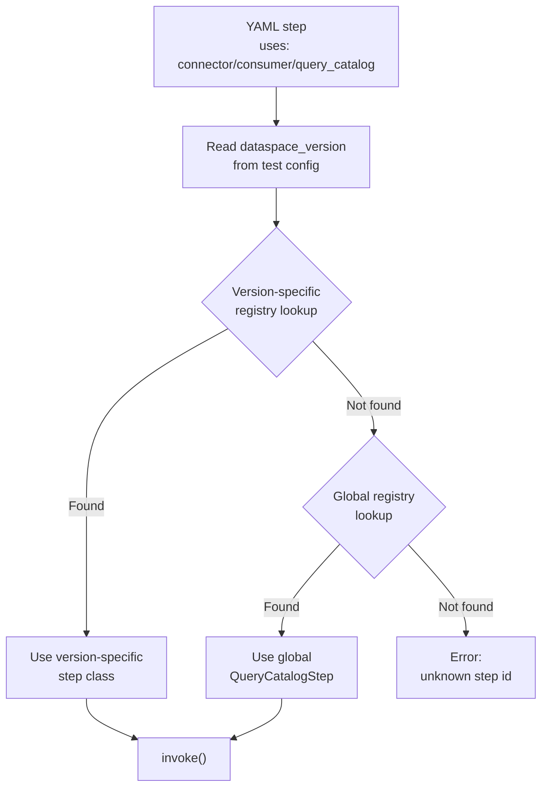
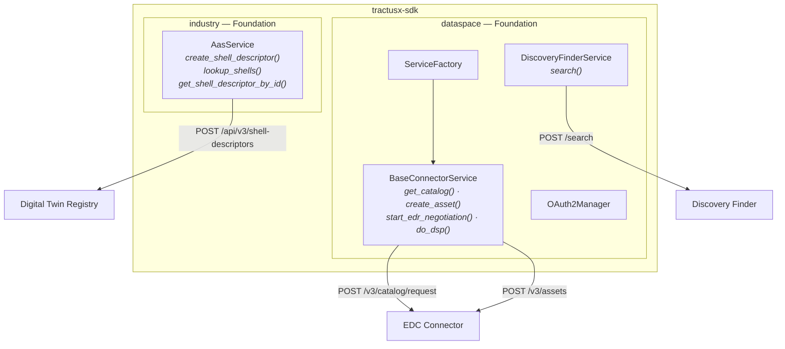
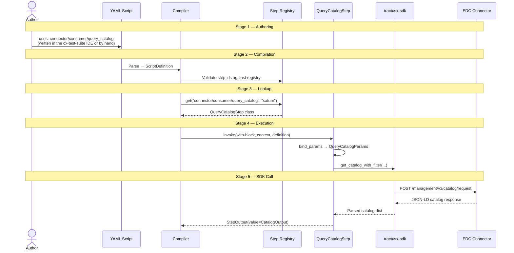
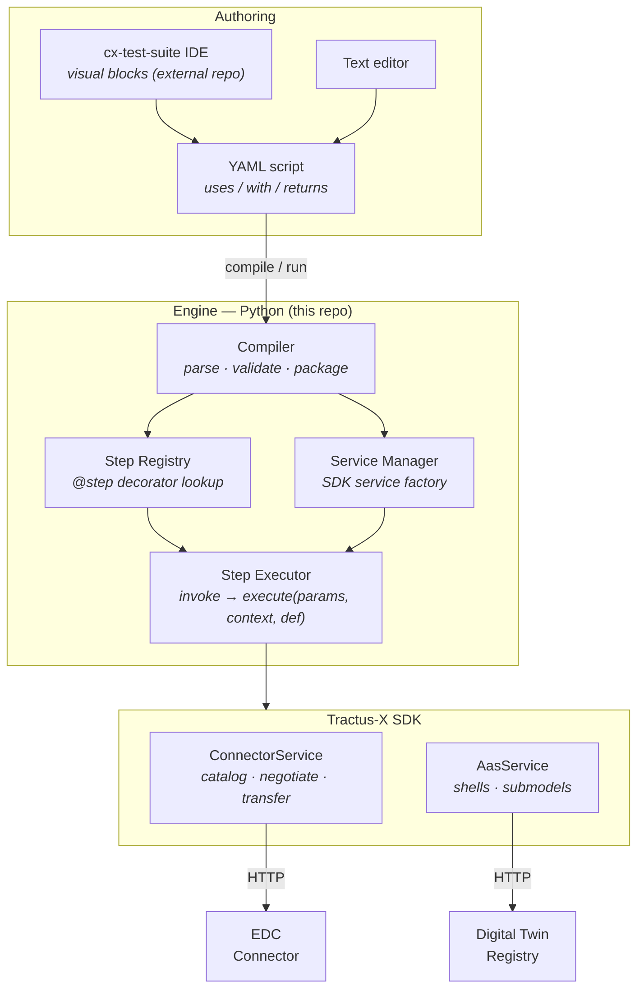

<!--
 Eclipse Tractus-X - Tractus-X TestLab

 Copyright (c) 2026 Contributors to the Eclipse Foundation

 See the NOTICE file(s) distributed with this work for additional
 information regarding copyright ownership.

 This program and the accompanying materials are made available under the
 terms of the Apache License, Version 2.0 which is available at
 https://www.apache.org/licenses/LICENSE-2.0.

 Unless required by applicable law or agreed to in writing, software
 distributed under the License is distributed on an "AS IS" BASIS, WITHOUT
 WARRANTIES OR CONDITIONS OF ANY KIND, either express or implied. See the
 License for the specific language governing permissions and limitations
 under the License.

 SPDX-License-Identifier: Apache-2.0
-->
<!-- This code was partially generated using artificial intelligence (AI) (Tool: Copilot, Model: Claude Opus 4.6). -->
<!-- It was reviewed and tested by a human committer. -->

# How a Step Works — From YAML to SDK Call

This guide explains the full lifecycle of a step in the engine: how it is written in
YAML, how the YAML is loaded and validated, how the registry finds the right Python
executor, and how the executor maps it to a real Tractus-X SDK call against
connectors, registries, or discovery services.

## Where the YAML comes from

Visual authoring happens in the **cx-test-suite IDE** (the separate frontend
repository): users assemble blocks in a Blockly workspace, and the IDE serializes
them into exactly the YAML this page describes. From the engine's point of view
there is no difference between a script the IDE emitted and one written in a text
editor — the YAML is the interface, and everything below this line is this
repository's code.

## The Big Picture

A step goes through **five stages** from YAML to execution:



| Stage | Where | Technology |
|-------|-------|------------|
| 1. YAML Script | authored (IDE or editor) | `uses:` / `with:` / `returns:` |
| 2. Loading & Validation | `compiler/`, `player/loading/` | Pydantic models |
| 3. Step Registry | `scripting/registry.py` | `@step` decorator |
| 4. Step Executor | `steps/` | `BaseStep.invoke()` |
| 5. SDK Service | `services/` → HTTP | `tractusx-sdk` |

Let's trace a real step — **`connector/consumer/query_catalog`** — through every stage.

---

## Stage 1: The YAML Step

A step is one entry in a script's `setup:`, `execution:`, or `teardown:` list:

```yaml
execution:
  - id: query
    uses: connector/consumer/query_catalog
    name: Ping Catalog
    with:
      counter_party_address: ${{ env.sut_dsp_url }}
      counter_party_id: ${{ env.sut_bpn }}
      filters:
        - operand_left: "https://w3id.org/edc/v0.0.1/ns/type"
          operator: "like"
          operand_right: "%"
    returns:
      datasets:
        type: array
    validate:
      - uses: validate/assert
        with: { input: datasets, operator: not_empty }
```

**What each key does:**

| Key | Value | Effect |
|-----|-------|--------|
| `uses` | `connector/consumer/query_catalog` | The canonical step id. This exact string links the step to its Python executor. |
| `with` | parameter map | Validated into the executor's declared `params_model` before any code runs. The connector the step talks to is not among them: services are seeded into the run, not authored. |
| `returns` | declared output fields | The fields the script reads from the output. Assertions resolve against them, and later steps reference them as `${{ steps.query.datasets }}`. |
| `validate` | assertion list | Each entry is itself in verb form (`uses: validate/assert`). |

!!! note "The `uses:` id is the bridge"
    The `uses: connector/consumer/query_catalog` in the YAML is the same string as
    the `@step("connector/consumer/query_catalog")` decorator in Python. This is how
    the two layers connect — and it is also the id under which the cx-test-suite
    IDE registers the corresponding block.

---

## Stage 2: Loading and Validation

The document is parsed into the authoring models (`ScriptDefinition`,
`StepDefinition` — see [Data Models](data-models.md)). The compiler
(`compiler/`) validates structure, references, and step ids against the registry
before a package is cut; the player (`player/loading/`) resolves includes and
ordering when a package is loaded for a run. A misspelled `uses:` id or an unknown
`with:` key fails here or at parameter binding — never silently.

---

## Stage 3: Step Registry (Lookup)

At run time the engine needs the Python class that implements each step. This is
the **Step Registry**.

**File:** `src/tractusx_testlab/scripting/registry.py`

```python
# The registry maps (step_type, dataspace_version) → BaseStep class
_REGISTRY: dict[tuple[str, str], type[BaseStep]] = {}
_GLOBAL_REGISTRY: dict[str, type[BaseStep]] = {}

class StepRegistry:
    @staticmethod
    def register(step_type: str, dataspace_version: Optional[str] = None):
        """Decorator to register a BaseStep class."""
        def decorator(cls):
            cls.step_type = step_type
            if dataspace_version:
                _REGISTRY[(step_type, dataspace_version)] = cls
            else:
                _GLOBAL_REGISTRY[step_type] = cls
            return cls
        return decorator

    @staticmethod
    def get(step_type: str, dataspace_version: str) -> Optional[type[BaseStep]]:
        """Look up by type + version. Version-specific wins over global."""
        return _REGISTRY.get((step_type, dataspace_version)) or _GLOBAL_REGISTRY.get(step_type)

# Convenience alias
step = StepRegistry.register
```

**Resolution flow:**



**Version-specific steps:** Some steps behave differently on Jupiter vs Saturn. These register with a version constraint:

```python
@step("connector/consumer/query_catalog", dataspace_version="saturn")
class QueryCatalogSaturnStep(BaseStep[QueryCatalogParams, CatalogOutput]): ...

@step("connector/consumer/query_catalog", dataspace_version="jupiter")
class QueryCatalogJupiterStep(BaseStep[QueryCatalogParams, CatalogOutput]): ...
```

Both still declare `params_model` and `output_model` — the contract is per class, not per step key.

Version-specific registrations always take priority over global ones.

---

## Stage 4: Step Executor (Python)

The step executor is a Python class that implements the actual logic. It declares what it accepts, what it returns, and what it publishes; the runner validates the resolved params (with `${{ ... }}` references substituted) into that declaration before `execute` runs.

**File:** `src/tractusx_testlab/steps/connector/catalog_query.py`

```python
from tractusx_testlab.scripting.registry import step
from tractusx_testlab.steps._contracts import CatalogOutput, CounterPartyParams
from tractusx_testlab.steps.base import BaseStep, StepOutput


class QueryCatalogParams(CounterPartyParams):
    """Input contract of ``connector/consumer/query_catalog``."""

    filters: list[FilterExpression] = Field(
        default_factory=list,
        description="Filter criteria applied to the catalog request.",
    )


@step("connector/consumer/query_catalog")
class QueryCatalogStep(BaseStep[QueryCatalogParams, CatalogOutput]):
    """Query a provider's catalog via the SDK connector consumer service."""

    params_model = QueryCatalogParams
    output_model = CatalogOutput

    async def execute(self, params, context, definition):
        # 1. Get the SDK service instance from the runtime context
        consumer = context.get_consumer_service()

        # 2. Read validated parameters (variables already substituted, types checked)
        catalog = consumer.get_catalog_with_filter(
            counter_party_id=params.counter_party_id,
            counter_party_address=params.counter_party_address,
            filter_expression=[entry.to_sdk() for entry in params.filters],
        )

        # 3. Return the declared models — the payload, and the variables published
        datasets = as_dataset_list(catalog)
        return StepOutput(
            value=CatalogOutput(catalog=catalog, datasets=datasets),
            request=HttpRequest(method="POST", url=url, body=params.model_dump(mode="json")),
            response=HttpResponse(status_code=200, body=catalog),
        )
```

**What the executor receives:**

| Argument | Source | Content |
|----------|--------|---------|
| `params` | YAML `with:` section with `${{ ... }}` references resolved, validated into `params_model` | A `QueryCatalogParams` instance — read `params.counter_party_address`, not `params["counter_party_address"]` |
| `context` | Runtime `StepContext` | Provides `get_consumer_service()`, `get_provider_service()`, `get_aas_service()`, `set_variable()`, `get_variable()` |
| `definition` | Full `StepDefinition` model | Includes `returns`, `validate`, `timeout_s` |

Binding happens in `BaseStep.invoke()`, which is what the runner calls: it validates the params, runs `execute`, serialises the returned payload back to plain JSON data, and publishes every top-level output field into the run context.

**What the executor returns:**

| Field | Purpose |
|-------|---------|
| `value` | The step's output data, in the declared `output_model` shape. |
| `request` | HTTP request details for debugging/logging. |
| `response` | HTTP response details for assertion evaluation and logging. |

After execution, the runtime:

1. Publishes every top-level output field into the run context under its own name (a `None` value leaves the variable unset)
2. Binds each `returns:` field: the name must be one the step's contract declares, and the value is stored flat and as `steps.<id>.<field>` for later references
3. Evaluates `validate:`: runs each assertion against the declared output
4. Records the result as a `StepResult` with pass/fail status

---

## Stage 5: SDK Service Call (Tractus-X SDK)

The step executor doesn't implement HTTP calls directly. It delegates to **tractusx-sdk** service classes that handle the actual protocol communication.

### How services are created

The `ServiceManager` (`src/tractusx_testlab/services/manager.py`) holds the run's service definitions — declared in a script's `services:` block or seeded from the TCK's `infrastructure.*` bindings at runtime — and initialises SDK instances lazily on first access:

```yaml
services:
  - name: sut-connector
    type: CONNECTOR_CONSUMER
    base_url: "https://connector.tractusx.io"
    params:
      dma_path: "/management"
```

This translates to (`src/tractusx_testlab/services/_factory.py`):

```python
from tractusx_sdk.dataspace.services.connector.service_factory import ServiceFactory

consumer_service = ServiceFactory.get_connector_consumer_service(
    dataspace_version="saturn",
    base_url="https://connector.tractusx.io",
    dma_path="/management",
    headers={"Content-Type": "application/json", "x-api-key": "..."},
)
```

Steps never name a service in their `with:` block — the `StepContext` accessors (`get_consumer_service()`, `get_provider_service()`, `get_aas_service()`) resolve the right seeded instance.

### The SDK layer

The `tractusx-sdk` library provides service classes that handle the actual HTTP communication with dataspace components:



**The SDK call for `query_catalog`:**

When `QueryCatalogStep.execute()` calls `consumer.get_catalog_with_filter(...)`, the SDK:

1. Builds a JSON-LD catalog request body per the DSP specification
2. Sends `POST {base_url}{dma_path}/v3/catalog/request` with the filter expression
3. Handles authentication (OAuth2 token or API key)
4. Parses the JSON-LD response into a Python dict
5. Returns the catalog containing datasets (offers)

The step executor then wraps this in a `StepOutput` for the runtime to process.

---

## Complete Trace: `query_catalog` End-to-End



Here's every file involved when a script runs this step:

### 1. YAML is loaded and validated

```text
src/tractusx_testlab/models/authoring/definitions.py
  → StepDefinition {uses: "connector/consumer/query_catalog", with: {...}}

src/tractusx_testlab/compiler/
  → validates structure, references, and step ids against the registry

src/tractusx_testlab/player/loading/
  → loads the compiled package, resolves ordering for the run
```

### 2. Registry resolves the executor

```text
src/tractusx_testlab/scripting/registry.py
  → StepRegistry.get("connector/consumer/query_catalog", ...) → QueryCatalogStep

src/tractusx_testlab/player/execution/step_runner.py
  → drives setup → execution → teardown, calls invoke() per step
```

### 3. Step executor runs

```text
src/tractusx_testlab/services/manager.py
  → holds seeded/declared service definitions, initialises SDK services lazily

src/tractusx_testlab/steps/connector/catalog_query.py
  → QueryCatalogStep.execute(params, context, definition)
  → calls context.get_consumer_service() → SDK connector consumer service
  → calls consumer.get_catalog_with_filter(...)
```

### 4. SDK makes the HTTP call

```text
tractusx_sdk.dataspace.services.connector
  → builds JSON-LD catalog request
  → POST {base_url}/management/v3/catalog/request
  → handles auth (OAuth2Manager or API key header)
  → parses response → Python dict

  → returns to QueryCatalogStep
  → step wraps it in StepOutput(value=CatalogOutput(catalog, datasets))
  → runtime publishes every output field (catalog, datasets)
  → runtime binds returns: and evaluates validate:
  → records StepResult with pass/fail
```

---

## The Mapping Table

Every step id maps to an SDK capability through this chain (a selection):

### EDC Connector Steps

| Step id | Step Executor | SDK Method |
|---------|---------------|------------|
| `connector/consumer/query_catalog` | `QueryCatalogStep` | `get_catalog_with_filter()` |
| `connector/consumer/negotiate` | `NegotiateStep` | `start_edr_negotiation()` |
| `connector/consumer/initiate_transfer` | `InitiateTransferStep` | `get_edr_entry()` |
| `connector/consumer/do_dsp` | `DoDspStep` | `do_dsp()` |
| `connector/provider/create_asset` | `CreateAssetStep` | `create_asset()` |
| `connector/provider/create_policy` | `CreatePolicyStep` | `create_policy()` |
| `connector/provider/create_contract_definition` | `CreateContractDefinitionStep` | `create_contract()` |

### Digital Twin Steps

| Step id | Step Executor | SDK Method |
|---------|---------------|------------|
| `digital-twin/provider/create_shell_descriptor` | `CreateShellDescriptorStep` | `create_asset_administration_shell_descriptor()` |
| `digital-twin/provider/get_shell_descriptor` | `GetShellDescriptorStep` | `get_asset_administration_shell_descriptor_by_id()` |
| `digital-twin-registry/consumer/dataplane/lookup_shell` | `LookupShellStep` | `lookup_shells()` |

The authoritative catalogue is the generated
[Step Reference](../specification/reference/steps.md) — regenerated from the
registry by `testlab docs`, so it cannot go stale.

---

## The Linking Rules

Understanding these rules is critical when adding new steps:

### Rule 1: The `uses:` id is the universal key

```text
YAML:      uses: connector/consumer/query_catalog
Python:    @step("connector/consumer/query_catalog")
```

Both must use the **exact same string** — and the cx-test-suite IDE registers its
block under the same id. A mismatch fails validation ("unknown step id").

### Rule 2: Output fields become runtime variables

```text
Python:    output_model = CatalogOutput      # declares `catalog` and `datasets`
Runtime:   context.get_variable("datasets")  # available to later steps
```

Every step publishes all of its return outputs: each top-level field of the output
becomes a context variable of the same name, and a `None` value leaves the variable
unset. See [Step Contracts](step-contracts.md).

### Rule 3: Services are the bridge to the SDK

```text
YAML:      (no service parameter — services are seeded into the run)
Runtime:   context.get_consumer_service()  → SDK connector consumer service
```

Connector services are seeded into the run context at runtime — from the TCK's
`infrastructure.*` bindings or a script `services:` block — and the `StepContext`
resolves them to live SDK instances created by the `ServiceManager`.

### Rule 4: Dataspace version selects the right code path

```text
TCK:       dataspace_version: saturn
Registry:  StepRegistry.get("connector/consumer/query_catalog", "saturn")
SDK:       ServiceFactory.get_connector_consumer_service(dataspace_version="saturn")
```

The dataspace version determines which SDK protocol version is used. Saturn uses DSP 2025-1 (EDC v0.11.x). Jupiter uses legacy DSP (EDC v0.8.x–0.10.x).

### Rule 5: Values flow through `${{ ... }}` references

```text
Step 1:    returns: { datasets: { type: array } }
Step 2:    with: { input: "${{ steps.query.datasets }}" }
Runtime:   resolved before invoke(), then validated into params_model
```

The runtime resolves `${{ steps.<id>.<field> }}` and `${{ env.<id> }}` references
before calling the step executor, then validates the result into the step's
`params_model`. The executor receives a typed model carrying plain values — no
references, no raw dict. A `returns:` name is only readable when the step's
contract declares it, so a typo fails at binding rather than as a `None` several
steps later.

---

## Architecture Diagram



---

## Summary

| Layer | Technology | Files | What it does |
|-------|-----------|-------|-------------|
| Visual authoring | cx-test-suite IDE (external repo) | — | Emits the YAML this engine compiles |
| Authoring models | Python (Pydantic) | `models/authoring/definitions.py` | The shapes of scripts, steps, TCK manifests |
| Compiler | Python | `compiler/` | Parses, validates, and packages YAML |
| Step Registry | Python | `scripting/registry.py` | Maps the `uses:` id → Python class via `@step` decorator |
| Step Executor | Python | `steps/connector/*.py`, `steps/industry/*.py`, … | Implements step logic, calls SDK services |
| Service Manager | Python | `services/manager.py` | Creates SDK service instances from seeded/declared definitions |
| SDK Services | Python (tractusx-sdk) | `tractusx_sdk.dataspace.services.*`, `tractusx_sdk.industry.services.*` | Handles HTTP communication with connectors, DTR, discovery |

The `uses:` id is the universal key that ties everything together. If you remember one thing from this guide: **the `uses:` id in YAML = `@step("id")` in Python — one universal key.**
