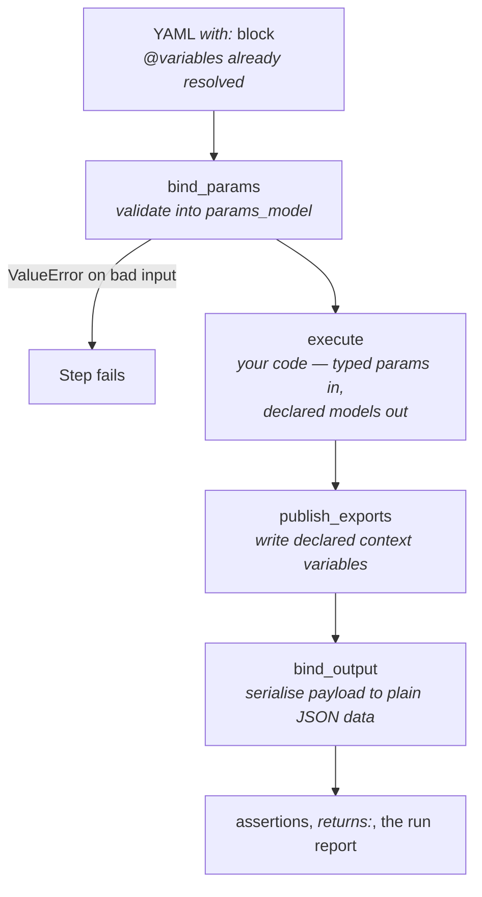

<!--
 Eclipse Tractus-X - Tractus-X TestLab

 Copyright (c) 2026 Contributors to the Eclipse Foundation

 See the NOTICE file(s) distributed with this work for additional
 information regarding copyright ownership.

 This program and the accompanying materials are made available under the
 terms of the Apache License, Version 2.0 which is available at
 https://www.apache.org/licenses/LICENSE-2.0.

 Unless required by applicable law or agreed to in writing, software
 distributed under the License is distributed on an "AS IS" BASIS, WITHOUT
 WARRANTIES OR CONDITIONS OF ANY KIND, either express or implied. See the
 License for the specific language governing permissions and limitations
 under the License.

 SPDX-License-Identifier: Apache-2.0
-->

# Creating a Step

A **step** is one executable action in a test script — querying a catalog, registering an asset, waiting for a callback. This page is the reference for writing one: the rules, the choices, and the models you can reuse.

If you would rather follow a single worked example end to end, start with the [Create a Step Executor tutorial](../tutorials/create-step-executor.md) and come back here for the details.

## The contract

Every step declares its interface. This is enforced, not encouraged: defining a `BaseStep` subclass without `params_model` and `output_model` raises `TypeError` at import time.

The declaration is what makes a step usable by everything around it:

- The runner validates the script's `with:` block against it before your code runs.
- Assertions and `returns:` navigate the output shape it promises.
- The [step reference page](../specification/reference/steps.md) is generated from it, so a parameter you rename in code cannot go stale in the docs.
- The next step's inputs can be *the same model* as this step's outputs, which is what makes the wiring between steps visible in the types.

### What runs, in what order

The runner calls `invoke()`. You implement `execute()`.



Two consequences worth internalising:

- **`execute` never sees a dict.** It receives a validated `params_model` instance. Read `params.url`, not `params["url"]`.
- **`execute` never returns raw data.** It returns the declared model. `bind_output` refuses anything else, even data that would have validated.

## The four base classes

| Base class | Role | Config |
|---|---|---|
| `StepParams` | one field per accepted `with:` key | `extra="allow"` — unknown keys are kept, so a script written against a newer step still runs on an older engine |
| `StepPayload` | one field per key of the returned object | `extra="forbid"` — the fields are the public surface |
| `StepValue[T]` | the output *is* a bare value, not an object | a Pydantic `RootModel`; no fields to declare |
| `StepExports` | context variables published for later steps | `extra="forbid"`, `populate_by_name=True` |

All four live in `tractusx_testlab.steps.base`.

## A minimal step

```python
"""Step executor for health check HTTP requests."""

from __future__ import annotations

from typing import TYPE_CHECKING, Any

import httpx
from pydantic import Field

from tractusx_testlab.models import HttpRequest, HttpResponse, StepDefinition
from tractusx_testlab.scripting.registry import step
from tractusx_testlab.steps.base import BaseStep, StepOutput, StepParams, StepPayload

if TYPE_CHECKING:
    from tractusx_testlab.player.execution.context import StepContext


class CheckHealthParams(StepParams):
    """Input contract of ``check_health``."""

    url: str = Field(description="Health endpoint URL.")
    timeout_s: float = Field(default=10, gt=0, description="Request timeout in seconds.")


class CheckHealthOutput(StepPayload):
    """Output contract of ``check_health``."""

    status_code: int = Field(description="Status code the endpoint answered with.")
    body: Any = Field(default=None, description="Response body, parsed as JSON when it is JSON.")


@step("util/check_health")
class CheckHealthStep(BaseStep[CheckHealthParams, CheckHealthOutput]):
    """Send a GET request to a health endpoint and report status and body."""

    params_model = CheckHealthParams
    output_model = CheckHealthOutput

    async def execute(
        self,
        params: CheckHealthParams,
        context: "StepContext",
        definition: StepDefinition,
    ) -> StepOutput[CheckHealthOutput]:
        async with httpx.AsyncClient(timeout=params.timeout_s) as client:
            resp = await client.get(params.url)
        try:
            body = resp.json()
        except ValueError:
            body = resp.text

        return StepOutput(
            value=CheckHealthOutput(status_code=resp.status_code, body=body),
            request=HttpRequest(method="GET", url=params.url),
            response=HttpResponse(status_code=resp.status_code, body=body),
        )
```

Note the four things that are not optional: the two model classes, the `params_model` / `output_model` assignments, and the `@step("...")` key.

The `BaseStep[CheckHealthParams, CheckHealthOutput]` type parameters are for your editor and type checker. They are *not* what the runtime reads — the class attributes are. Keep them in agreement.

## Declaring inputs

### Required, optional, and validated

A field with no default is required. A missing or ill-typed one fails the step before `execute` runs, with a message that names the field:

```
Invalid parameters for step 'util/check_health': url: Field required
```

Push validation into the model rather than writing it by hand. Pydantic's constraints (`gt`, `ge`, `min_length`, `Literal[...]`) document themselves on the generated reference page, which hand-written checks do not:

```python
class DelayParams(StepParams):
    """Input contract of ``flow/delay``."""

    seconds: float = Field(default=1, ge=0, description="How long to wait.")


class Base64Params(StepParams):
    """Input contract of ``util/base64``."""

    input: str = Field(description="Text to encode, or base64 to decode.")
    mode: Literal["encode", "decode"] = Field(default="encode", description="Direction.")
```

### Accepting more than one spelling

Scripts in the wild use legacy names. Accept them with `AliasChoices` — the canonical name first, and the reference page lists the rest under "Also accepts":

```python
class CounterPartyParams(StepParams):
    counter_party_address: str = Field(
        default="",
        validation_alias=AliasChoices("counter_party_address", "provider_url"),
        description="DSP endpoint of the counter-party connector.",
    )
```

### Normalising shapes

When a parameter legitimately arrives in more than one shape, fold it in a validator so `execute` sees one shape. Two patterns from the codebase:

```python
class PullDataFilteredByPolicyParams(PullDataParams):
    policies: list[dict] = Field(min_length=1, description="...")

    @field_validator("policies", mode="before")
    @classmethod
    def _one_policy_is_a_list_of_one(cls, value: Any) -> Any:
        """A single policy document is as valid as a list holding it."""
        return [value] if isinstance(value, dict) else value


class QueryCatalogParams(CounterPartyParams):
    filter_expression: list[FilterExpression] = Field(default_factory=list)
    filter: Optional[CatalogFilter] = Field(default=None)

    @model_validator(mode="after")
    def _hoist_nested_filter(self) -> "QueryCatalogParams":
        """Let the nested ``filter:`` block stand in for a flat ``filter_expression``."""
        if not self.filter_expression and self.filter is not None:
            self.filter_expression = self.filter.filter_expression
        return self
```

Give the params model helper methods when a value needs converting for a downstream API. `sdk_filter_expression()` and `service_name()` exist for exactly that, and they keep `execute` about the step's logic rather than about reshaping its own inputs.

### Fields named like Pydantic attributes

`schema` shadows a `BaseModel` attribute and warns. Declare the field under another name and alias it back, so scripts keep writing `schema:`:

```python
json_schema: dict = Field(
    validation_alias=AliasChoices("schema", "json_schema"),
    serialization_alias="schema",
    description="JSON Schema the payload is validated against.",
)
```

## Declaring the output

### Choosing the kind

| Your output is… | Declare | Example |
|---|---|---|
| an object with named fields | a `StepPayload` subclass | `CreateAssetOutput(asset_id=...)` |
| a bare value — a string, a list, whatever a path pointed at | a `StepValue[T]` subclass | `Base64Output(StepValue[str])` |
| a document defined by someone else's spec | a `StepPayload` with `extra="allow"`, bound with `.of()` | `CatalogPayload` |
| nothing at all | `NoOutput` | `flow/delay`, the `delete_*` steps |

Do not invent a wrapper object around a bare value to satisfy `StepPayload`. That would change the shape every existing script reads. `StepValue` exists so the type can be declared without touching the wire format — its docstring is the description, since there is only one value to describe:

```python
class Base64Output(StepValue[str]):
    """The encoded or decoded string."""
```

`NoOutput` is a declaration, not an omission. "This step produces nothing" and "nobody wrote down what this step produces" must not look the same to a script author.

### Documents that come from a counterpart

A DCAT catalog, an AAS descriptor, and an EDR data address are shaped by their own specifications. Name the keys scripts assert on, let the rest through untouched, and bind the document with `of()`:

```python
class CatalogPayload(StepPayload):
    """A provider's DCAT catalog."""

    model_config = ConfigDict(extra="allow")

    context: Any = Field(default=None, alias="@context", description="JSON-LD context.")
    id: Optional[str] = Field(default=None, alias="@id", description="Catalog ID.")
    ...

# in execute():
return StepOutput(value=CatalogPayload.of(catalog))
```

`of()` returns `None` for an absent document, keeping "the provider answered with nothing" distinct from "the provider answered with `{}`".

Note what `CatalogPayload` deliberately does *not* set: `populate_by_name`. Only the JSON-LD spellings populate those fields, so a provider that happens to send a plain `id` key keeps it as `id` rather than having it silently rewritten to `@id`.

### What gets serialised

`bind_output` dumps the payload with `by_alias=True, exclude_unset=True`. The rule is **the output contains exactly what the step produced**:

- A pass-through document keeps the keys the provider sent and gains no `"@type": null` for the ones it omitted.
- A field you deliberately set to `None` still appears as null, because you said so.
- **A field you leave to its default is absent from the output.** Pass every field you mean to publish, explicitly.

`StepValue` is exempt: its `root` is already the plain data a script reads, so it is handed over as-is rather than dumped in JSON mode, which would coerce whatever a provider sent.

### Returning nothing on a failure path

`StepOutput(value=None)` is allowed and means the step produced no value on this path. Report the failure through the HTTP record rather than by raising, when a script should be able to assert on it:

```python
if not catalog:
    logger.error("Catalog request returned no result: url=%s", url)
    return StepOutput(
        value=None,
        request=request,
        response=HttpResponse(status_code=500, body=None),
    )
```

## Declaring published variables

A step's return value is only half of what it produces. Steps also hand data to later steps through context variables, and until those are declared, that half of the interface is invisible.

Return a `StepExports` instance from `execute`; do not call `context.set_variable` yourself. Field names are variable names, so alias them to the constants in `syntax.context_vars` and let the constant stay the single source of truth:

```python
class NegotiationExports(StepExports):
    """Context variables published by ``connector/consumer/negotiate``."""

    negotiation_id: Optional[str] = Field(
        default=None,
        alias=NEGOTIATION_ID,
        description="ID the transfer step polls for the resulting EDR.",
    )

# in execute():
return StepOutput(..., exports=NegotiationExports(negotiation_id=negotiation_id))
```

A field left `None` is **not published** — that is how a best-effort export stays absent rather than being written as null.

### The escape hatch

Some variable names come from the script, not the step: `store_in_variable`, or `mock/api`'s `id`. Those cannot be `StepExports` fields, because the step does not know the name. Declare them as *parameters* and write them directly. `StoreInVariableParams` and `MockIdParams` exist for this; both say so in their docstrings, which is what keeps the exception visible instead of looking like an oversight.

## Reusing a contract another step already declares

When two steps talk about the same thing, they share one model. Sharing is what makes the wiring visible: `do_dsp` publishes `DataplaneExports`, `connector/dataplane/http_request` reads exactly those variables, and both say so in their types.

Shared models live in `tractusx_testlab.steps._contracts`:

| Model | Kind | Use it for |
|---|---|---|
| `ServiceParams` | params mixin | `service` — which configured connector service to talk to; `service_name()` |
| `CounterPartyParams` | params mixin | `counter_party_address` / `counter_party_id`, with their legacy spellings |
| `FilterExpressionParams` | params mixin | catalog filter criteria; `sdk_filter_expression()` |
| `StoreInVariableParams` | params mixin | the `store_in_variable` escape hatch |
| `HttpTransportParams` | params mixin | `headers`, `timeout`, `timeout_or(default)` |
| `HttpCallParams` | params mixin | the above plus `method` and `body` |
| `CatalogPayload` | payload | a provider's DCAT catalog |
| `DataAddressPayload` | payload | an EDR data address; `data_address_token()` reads its token under either spelling |
| `HttpBodyOutput` | value | a response body — parsed JSON, or text |
| `NoOutput` | value | a step that produces nothing |
| `CatalogDatasetsExports` | exports | the `datasets` a catalog query publishes |
| `DataplaneExports` | exports | the `data_address` / `edr_token` pair |

Mock-server steps additionally share `MockIdParams` and `RequiredMockIdParams` from `tractusx_testlab.steps.server._contracts`.

Compose them by inheritance:

```python
class DoDspParams(CounterPartyParams, FilterExpressionParams):
    """Input contract of ``connector/consumer/do_dsp``."""

    policies: list[dict] = Field(default_factory=list, description="...")
```

Add to `_contracts.py` when a second step needs the same thing — not in anticipation of one. A mixin used once is just indirection.

## Registering the step

The `@step` decorator maps the YAML key to the class and stamps `step_type` onto it:

```python
@step("connector/provider/create_asset")
class CreateAssetStep(BaseStep[CreateAssetParams, CreateAssetOutput]): ...
```

Register with a version constraint when behaviour differs by dataspace version. Version-specific registrations take priority over global ones:

```python
@step("query_catalog", dataspace_version="saturn")
class QueryCatalogSaturnStep(BaseStep[QueryCatalogParams, CatalogPayload]): ...
```

The decorator only runs if the module is imported. Add your module to its subpackage's `__init__.py`:

```python
# src/tractusx_testlab/steps/utility/__init__.py
import tractusx_testlab.steps.utility.check_health  # noqa: F401
```

The subpackages are already imported by `steps/__init__.py`, so nothing else needs touching.

## What fails, and what it says

| Mistake | Raised by | Message |
|---|---|---|
| No `params_model` | class definition | `Step 'X' must set params_model to a StepParams subclass…` |
| No `output_model` | class definition | `Step 'X' must set output_model to a StepPayload subclass…` |
| `output_model` set to a params model | class definition | same as above |
| Script omits a required param | `bind_params` | `Invalid parameters for step 'util/base64': input: Field required` |
| Script passes a wrong type | `bind_params` | `…: mode: Input should be 'encode' or 'decode'` |
| `execute` returns a raw dict | `bind_output` | `Step 'X' returned dict, but declares output_model=Y. Build the declared model…` |

The first three fire at *import*, so a broken step never reaches a test run.

## Testing a step

Call `invoke()`, not `execute()`. `invoke()` is the path the runner takes — it validates the params, runs `execute`, publishes exports, and serialises the output — so a test that calls it exercises what a script actually gets.

```python
@pytest.mark.asyncio
async def test_returns_status_and_body(context: StepContext) -> None:
    output = await CheckHealthStep().invoke(
        {"url": "https://example.com/health"}, context, _definition()
    )
    assert output.value == {"status_code": 200, "body": {"status": "UP"}}
```

Assert on the *plain data*, not on model attributes — that is what assertions and `returns:` will navigate, and it catches serialisation mistakes such as a field that silently vanished because it was left to its default.

Cover the three things the contract promises:

```python
async def test_rejects_a_missing_url(self, context: StepContext) -> None:
    """A required parameter that is absent fails before execute runs."""
    with pytest.raises(ValueError, match="url: Field required"):
        await CheckHealthStep().invoke({}, context, _definition())


async def test_publishes_the_endpoint_for_later_steps(self, context: StepContext) -> None:
    await DoDspStep().invoke({...}, context, _definition())
    assert context.get_variable(DATA_ADDRESS) == "https://dataplane.example"


async def test_absent_keys_are_not_invented(self) -> None:
    """A catalog without ``@type`` must not come back carrying ``"@type": null``."""
    output = QueryCatalogStep.bind_output(
        StepOutput(value=CatalogPayload.of({"@id": "c1", "dcat:dataset": []}))
    )
    assert output.value == {"@id": "c1", "dcat:dataset": []}
```

`StepContext` uses `__slots__` and cannot be monkeypatched; use the shared `mock_context` fixture from `tests/conftest.py` when you need to stub services.

`tests/test_step_contracts.py` runs over *every* registered step automatically — inputs are a `StepParams`, output is a `StepPayload` or `StepValue`, exports are a `StepExports`, and the contract is describable with a non-empty docstring. Your new step is covered by it the moment it registers, so give it a real docstring: the first paragraph becomes its summary on the reference page.

## Regenerating the reference

```bash
testlab docs           # rewrites docs/specification/reference/steps.md
testlab docs --check   # CI runs this; fails if the page is out of date
```

Your step appears automatically with its parameters, defaults, accepted aliases, output fields, and published variables. Nested models are rendered once, in a shared section.

The generator reads `model_fields`, not `model_json_schema()`, because JSON Schema drops `AliasChoices` — and the legacy spellings a step still accepts are exactly what a script author needs to see. Write field descriptions as full sentences; they are the documentation.

## Checklist

- [ ] Params model declares every `with:` key, with descriptions and constraints
- [ ] Legacy spellings accepted via `AliasChoices`
- [ ] Output model is the right kind — `StepPayload`, `StepValue`, or `NoOutput`
- [ ] Documents from a counterpart bound with `.of()`, `extra="allow"`
- [ ] Every field the payload should publish is passed explicitly, not left to a default
- [ ] Fixed-name context variables returned as `exports`, aliased to `context_vars` constants
- [ ] Shared contracts reused rather than re-declared
- [ ] `@step("...")` key matches the block JSON's `type`
- [ ] Module imported from its subpackage `__init__.py`
- [ ] Class and model docstrings written — they are the reference page
- [ ] Tests call `invoke()` and assert on plain data
- [ ] `testlab docs` run and the regenerated page committed

## See also

- [Create a Step Executor](../tutorials/create-step-executor.md) — the same material as a worked example
- [Step Reference](../specification/reference/steps.md) — the generated catalogue of every step
- [Block Lifecycle](block-lifecycle.md) — how a block in the IDE becomes a step execution
