<!--

Eclipse Tractus-X - Software Development KIT

Copyright (c) 2026 Catena-X Automotive Network e.V.
Copyright (c) 2026 Contributors to the Eclipse Foundation

See the NOTICE file(s) distributed with this work for additional
information regarding copyright ownership.

This work is made available under the terms of the
Creative Commons Attribution 4.0 International (CC-BY-4.0) license,
which is available at
https://creativecommons.org/licenses/by/4.0/legalcode.

SPDX-License-Identifier: CC-BY-4.0

-->

# Concepts & Terminology

## Conceptual Model

The Testlab framework is composed of five core layers — Authoring, Compilation, Packaging, Execution, and Server — supported by a versioned Step Library and Managed Services.

```mermaid
graph LR
    subgraph Testlab
        A["Authoring<br/><i>YAML Tests</i>"]
        B["Compiler<br/><i>Validate · Resolve · Stamp</i>"]
        C["Package<br/><i>.tckpkg (ZIP)</i><br/><i>manifest + scripts + assets</i>"]
        D[\"Player<br/><i>Load · Execute · Monitor · Assert · Log<br/>Job lifecycle · Wait/Resume</i>\"]
        E["Server<br/><i>Package upload · Execution API<br/>Callback endpoints<br/>Dynamic API routes</i>"]

        A --> B --> C --> D
        D <-.-> E
    end

    subgraph Step Library
        direction TB
        F["Connector Steps<br/><i>create_asset · create_policy<br/>query_catalog · negotiate<br/>initiate_transfer · get_edr</i>"]
        G["Digital Twin Steps<br/><i>shell and submodel descriptors<br/>lookup_shell · upload</i>"]
        H["Dataplane Steps<br/><i>connector/dataplane/http_request<br/>(GET/POST/PUT/DELETE)<br/>with EDR auth</i>"]
        I["Utility and Validation Steps<br/><i>util/ · validate/<br/>mock/ · flow/</i>"]
    end

    subgraph Managed Services
        direction TB
        J["Service Manager<br/><i>ConnectorConsumer<br/>ConnectorProvider<br/>DTR (AAS)</i>"]
    end

    D -.-> F
    D -.-> G
    D -.-> H
    D -.-> I
    D -.-> J

    style A fill:#e1f5fe,stroke:#0288d1
    style B fill:#fff3e0,stroke:#f57c00
    style C fill:#e8f5e9,stroke:#388e3c
    style D fill:#f3e5f5,stroke:#7b1fa2
    style E fill:#e8eaf6,stroke:#3f51b5
    style F fill:#fce4ec,stroke:#c62828
    style G fill:#fce4ec,stroke:#c62828
    style H fill:#fce4ec,stroke:#c62828
    style I fill:#fce4ec,stroke:#c62828
    style J fill:#fff9c4,stroke:#f9a825
```

## Lifecycle Flow

The lifecycle spans three phases: **Author** → **Compile** → **Execute**. Each phase produces artifacts consumed by the next.

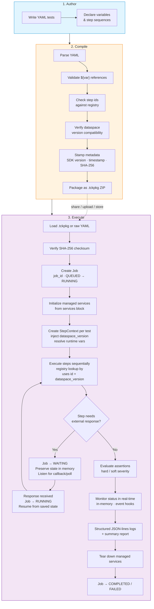

## Step Execution Detail

Within the Player, each step follows a precise execution sequence:

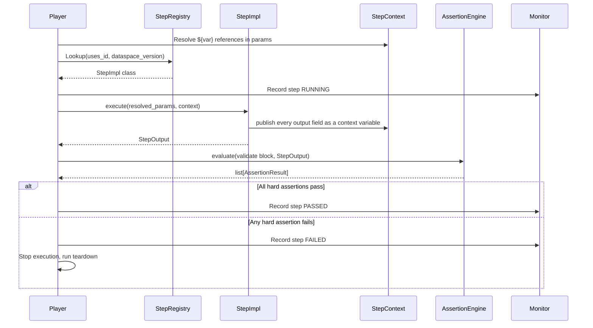

## Typed Step Execution

Every step is a **typed executor** registered in the Step Registry under its `uses:` id. Each step declares an input contract (its `with:` parameters) and an output contract (what `returns:` and assertions read), both validated at compile time.

**Security model:** There is no generic "call any SDK function" step — SDK access happens only inside step implementations, so a YAML script can never invoke arbitrary code.

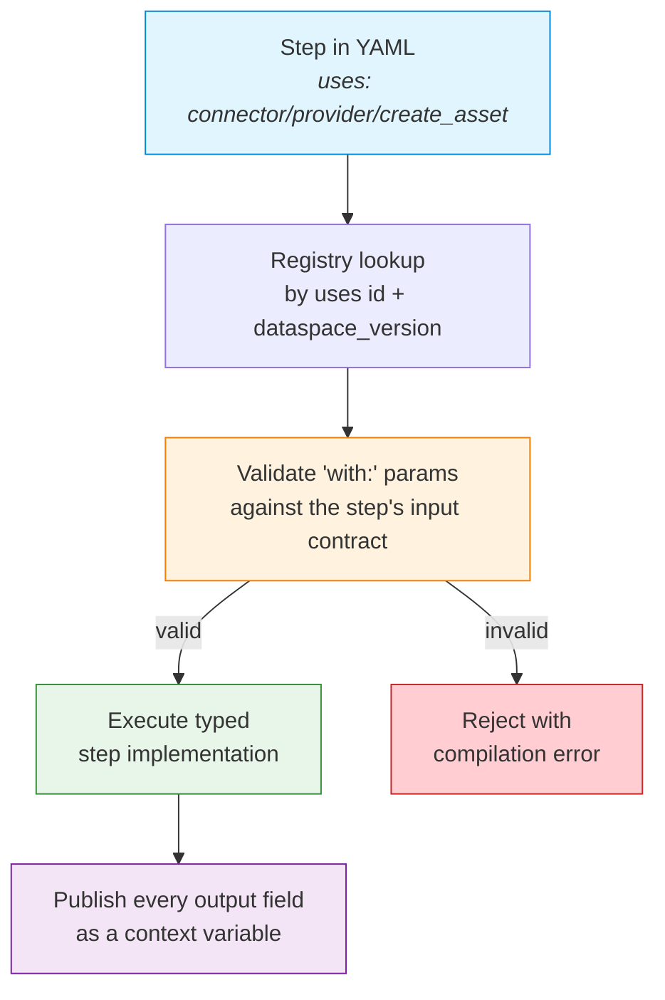

## Job-Based Execution Model

Every test execution is treated as a **Job** — a first-class, stateful entity with a unique identity, persistent memory, and the ability to pause and resume. This design supports long-running test scenarios where a step must wait for an external system to respond (e.g., notification acknowledgments, async transfer completions, webhook callbacks).

### Job Lifecycle

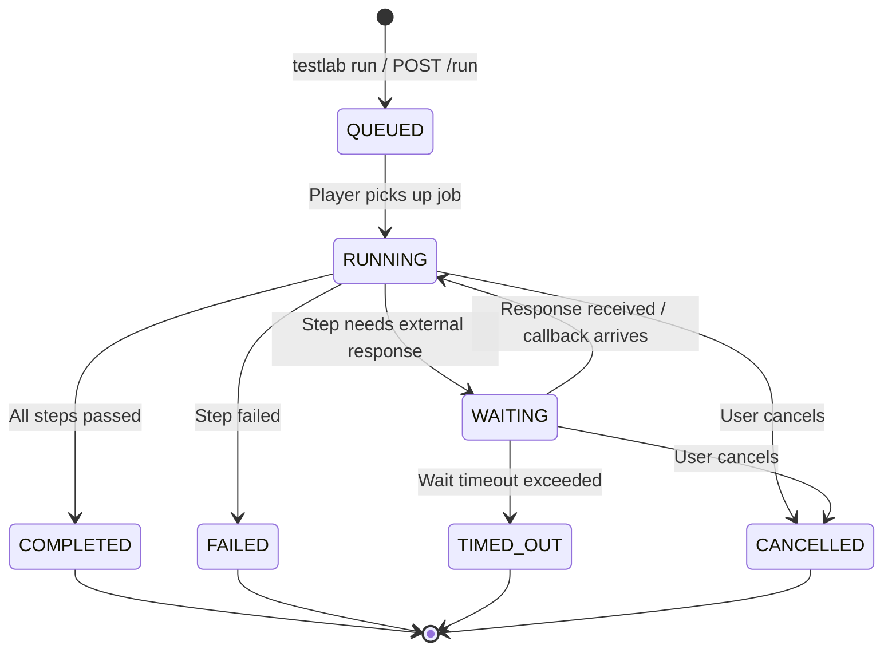

### How Jobs Work

1. **Creation** — When `testlab run` is invoked (CLI, API, or Python), a `Job` is created with a unique `job_id`, the provided runtime variables, and an empty `JobMemory`. Status: `QUEUED`.

2. **Execution** — The Player picks up the job and begins executing steps sequentially. Status: `RUNNING`. Each step can read from and write to the job's memory via `context.job.memory`.

3. **Waiting** — When a step requires an external response (e.g., `mock/wait/http_request`, polling for a state transition), the job transitions to `WAITING`. The `waiting_for` field describes what the job is blocked on. The job's memory and full execution state are preserved.

4. **Resumption** — When the expected event arrives (callback received, poll condition met), the job automatically resumes from where it paused. Status returns to `RUNNING`. The received payload is stored in both the step context and the job memory.

5. **Completion** — When all steps finish, the job transitions to `COMPLETED` (all passed) or `FAILED` (any hard failure). The full `TckResult` is attached to the job.

### Wait and Resume Flow

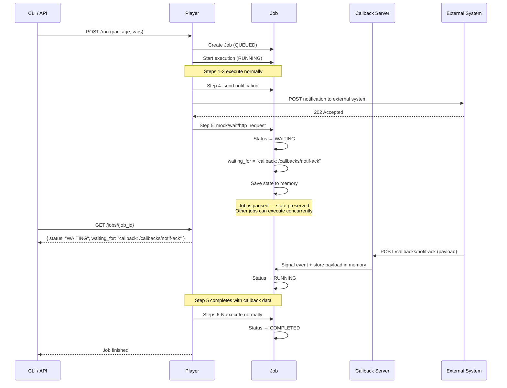

### Job Memory

The `JobMemory` is a persistent key-value store attached to each job. Unlike step context variables (scoped to a single test), job memory persists across:

- All tests within a TCK
- Wait/resume cycles
- Cleanup phases

Within a single test, steps publish their declared outputs — later steps reference them via `${{ steps.<id>.<output> }}`, and even a step that resumes after a wait keeps the earlier outputs available:

```yaml
setup:
  # Expose a callback endpoint the SUT will acknowledge to
  - id: ack_endpoint
    uses: mock/api
    with:
      path: /callbacks/notification-ack
      method: POST
      response_status: 200

steps:
  # Step 1: Send the notification, handing out the mock's URL as reply address
  - id: notify_quality_alert
    uses: notification/consumer/send
    with:
      counter_party_id: ${{ env.sut_bpn }}
      counter_party_address: ${{ env.sut_dsp_url }}
      notification:
        content: { ... }

  # Step 2: Wait for the acknowledgment to arrive on the mock endpoint
  - id: wait_for_ack
    uses: mock/wait/http_request
    with:
      mock: ${{ setup.ack_endpoint.mock }}
      timeout_s: 120
    returns:
      request_body:
        type: object
        class: ResponseBody
    # Step 3: Verify the acknowledgment straight off the inbound request
    validate:
      - uses: validate/assert
        with: { input: request_body, operator: not_null }
```

### Job Queries

Jobs are queryable at any time through the Monitor or API:

| Query | CLI | API | Returns |
|-------|-----|-----|---------|
| List all jobs | `testlab jobs` | `GET /api/v1/jobs` | All jobs with status, timing |
| Get job detail | `testlab job <job_id>` | `GET /api/v1/jobs/{job_id}` | Full job state, memory, result |
| Cancel a job | `testlab cancel <job_id>` | `POST /api/v1/jobs/{job_id}/cancel` | Cancellation confirmation |
| Get job memory | — | `GET /api/v1/jobs/{job_id}/memory` | Current memory key-value pairs |
| Get job events | — | `GET /api/v1/jobs/{job_id}/events` | Chronological event log |

## Managed Service Lifecycle

Tests can declare required SDK services in a `services` block. These services are initialized once before step execution begins and remain available throughout the test's lifetime, avoiding repeated authentication and initialization overhead.

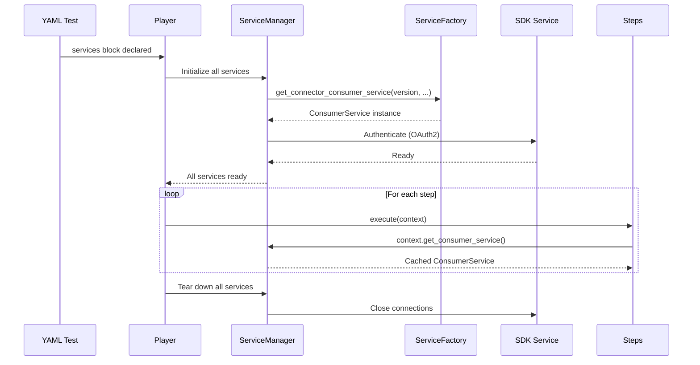

Services are seeded once at run start and live for the whole run — steps never create, replace, or stop services mid-test.

## Async Callbacks / Webhook Endpoints

For operations that require waiting for an external response (e.g., notification acknowledgments, async processing results), scripts register a callback endpoint on the TestLab mock server via the `mock/api` step and hand its `full_mock_url` to the system under test. When a `mock/wait/http_request` step runs, the parent Job transitions to `WAITING` state — preserving all execution context in its memory — and resumes automatically when the callback arrives.

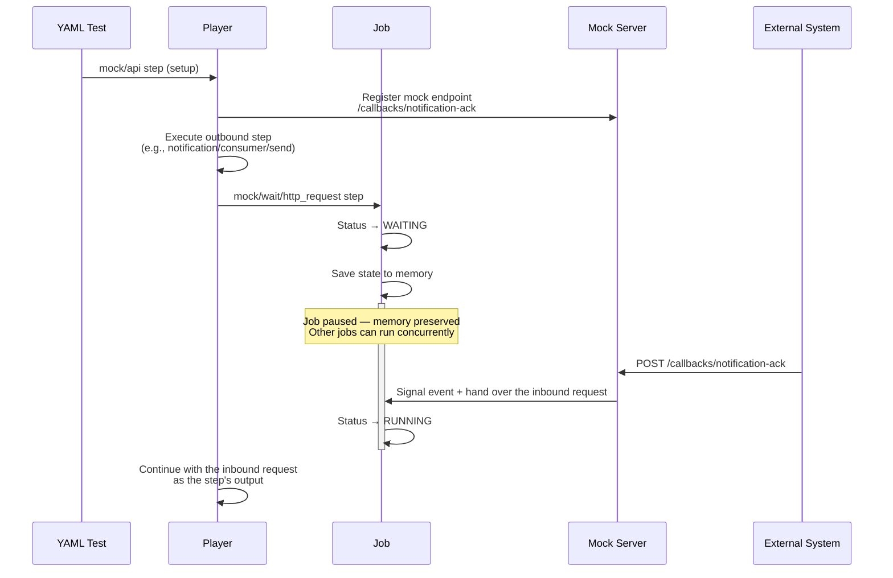

The mock server is either:

- **Auto-started** by the Player when a run registers mock endpoints (standalone mode)
- **Shared** with the host application’s FastAPI instance (embedded mode via `TestlabPlayer.from_app()`)

Timeouts are enforced via `asyncio.wait_for()`. If the callback is not received within `timeout_s`, the `mock/wait/http_request` step fails, failing the test. Mock registrations live for the duration of the run and are torn down with the mock server when the run finishes.

## Player Deployment Modes

The Player supports two deployment modes to accommodate different use cases:

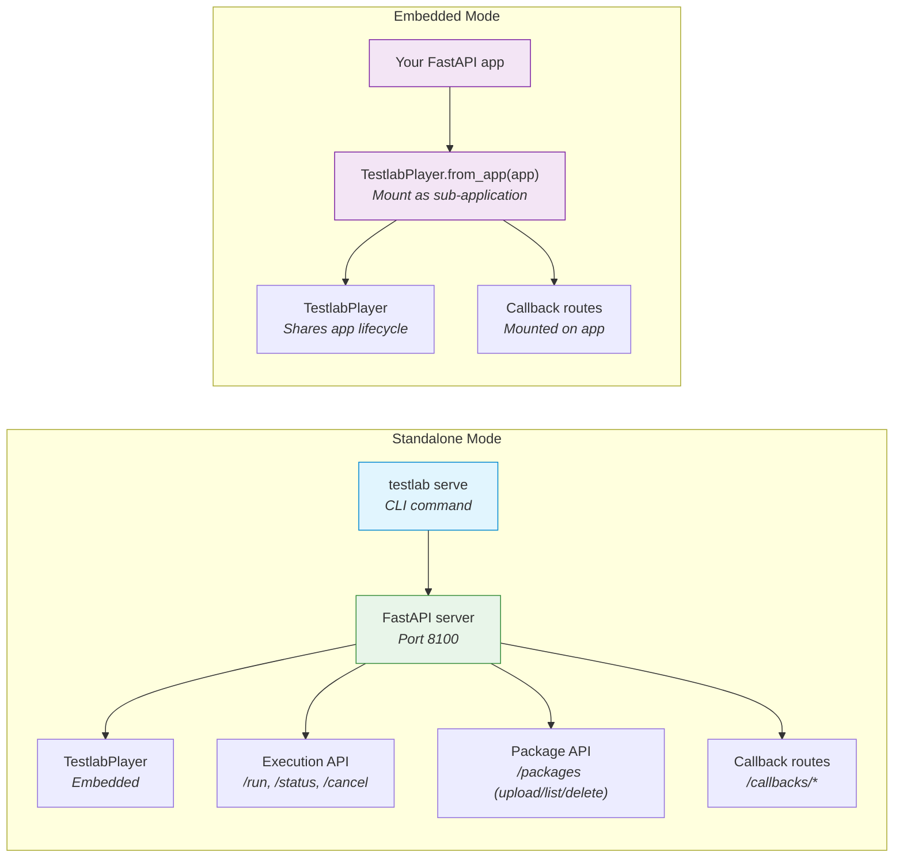

| Mode | Entry Point | Use Case |
|------|-------------|----------|
| **Standalone** | `testlab serve --port 8100` | CI/CD pipelines, dedicated test runners, quick local testing |
| **Embedded** | `TestlabPlayer.from_app(fastapi_app)` | Integrating testlab into an existing service, sharing infrastructure |

## Package Security & Encryption

Compiled `.tckpkg` packages can be encrypted so that only authorized Player instances can decrypt and execute them. This uses **hybrid encryption** (symmetric content encryption + asymmetric key wrapping) combined with **digital signatures** for authenticity.

### Encryption Flow (Compile-time)

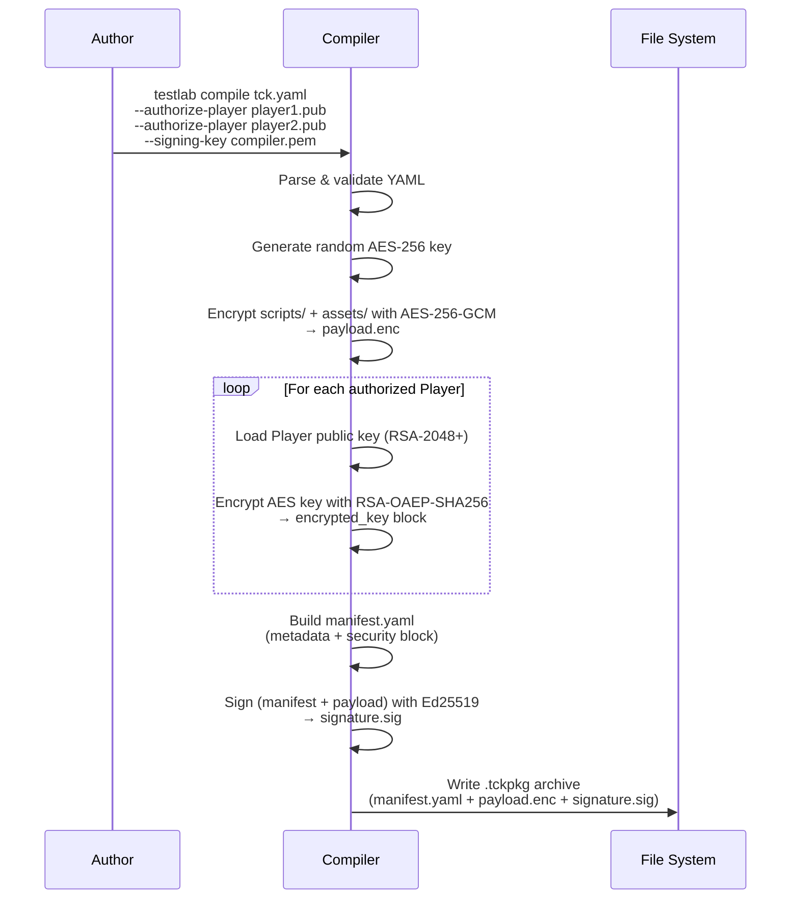

### Decryption Flow (Player-side)

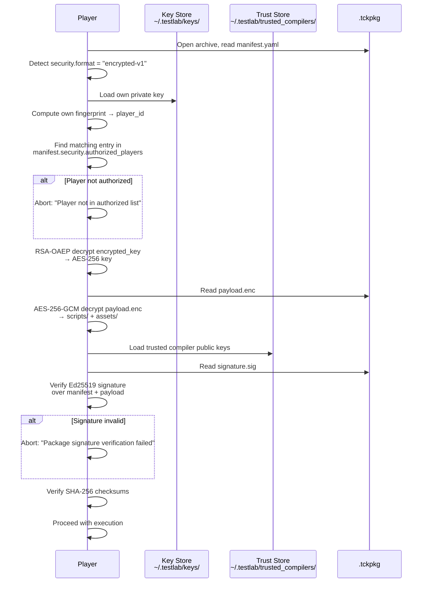

### Key Management Overview

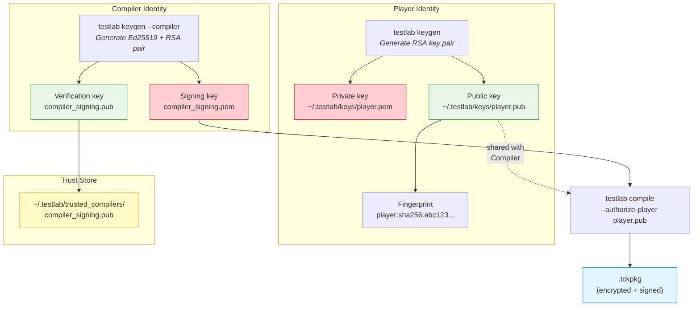

**Key Details:**

| Aspect | Detail |
|--------|--------|
| **Content encryption** | AES-256-GCM — authenticated encryption with associated data |
| **Key wrapping** | RSA-OAEP with SHA-256 — each authorized Player's public key wraps a copy of the AES key |
| **Package signing** | Ed25519 — Compiler signs `manifest.yaml` + `payload.enc` for authenticity |
| **Player identity** | RSA-2048+ key pair per Player instance; fingerprint = `SHA-256(DER-encoded public key)` |
| **Compiler identity** | Ed25519 key pair; public key distributed to Players via trust store |
| **Backward compatibility** | Packages without a `security` block remain valid and unencrypted (default for development) |
| **Cryptography library** | Python `cryptography` package (Fernet-free; direct primitives only) |

## Service-Step Binding

When a TCK declares services in its `env.services` block, those services are registered with the **ServiceManager** and seeded into the run at startup. Steps never name a service in their parameters — each step resolves the service for its role (connector provider, connector consumer, DTR) from the `StepContext`. This section documents the exact resolution mechanism, type validation, and API contracts.

### Resolution Mechanism

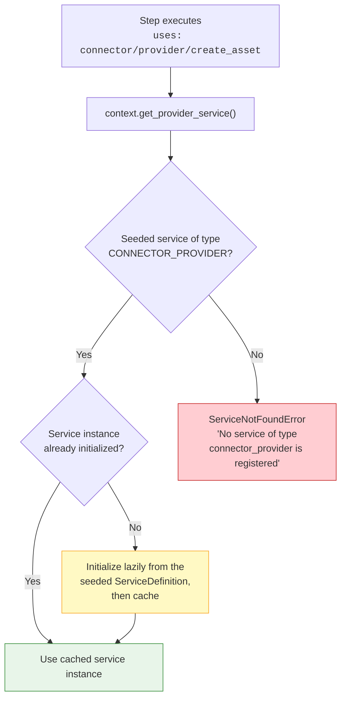

### Resolution by Role

| Step family | Context accessor | Seeded ServiceType |
|-------------|------------------|--------------------|
| `connector/provider/*` | `context.get_provider_service()` | `CONNECTOR_PROVIDER` |
| `connector/consumer/*` | `context.get_consumer_service()` | `CONNECTOR_CONSUMER` |
| `notification/consumer/*` | `context.get_notification_service()` | `CONNECTOR_CONSUMER` |
| `digital-twin/*` | `context.get_aas_service()` | `DTR` |
| `connector/dataplane/http_request`, `http/http_request`, `util/*`, `validate/*`, `mock/*`, `flow/*` | *(none — no managed service involved)* | N/A |

A step whose role has no seeded service fails with a `ServiceNotFoundError` identifying the missing service type.

### Step Execution with Service Binding (Detailed Sequence)

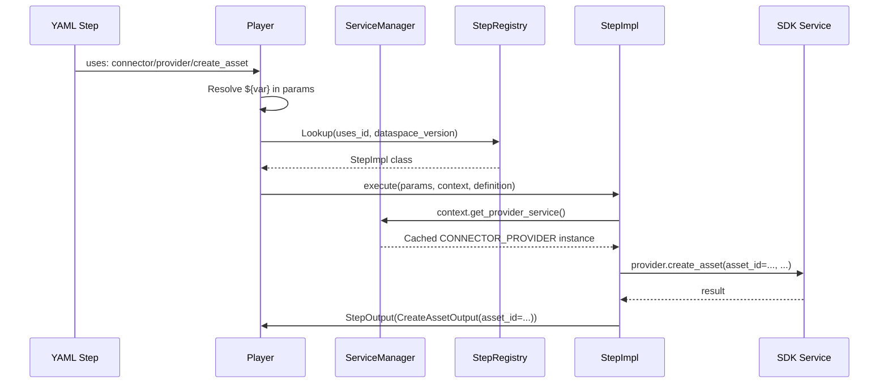

### StepContext API (Service Access)

The `StepContext` provides these methods for service access during step execution:

```python
class StepContext:
    def get_provider_service(self) -> object:
        """Return the CONNECTOR_PROVIDER service the run was seeded with.

        Raises:
            ServiceNotFoundError: If no provider service is registered.
        """

    def get_consumer_service(self) -> object:
        """Return the CONNECTOR_CONSUMER service the run was seeded with.

        Raises:
            ServiceNotFoundError: If no consumer service is registered.
        """

    def get_aas_service(self) -> object:
        """Return the DTR / AAS service the run was seeded with.

        Raises:
            ServiceNotFoundError: If no DTR service is registered.
        """

    def get_notification_service(self) -> object:
        """Return the service notifications are sent through.

        Notifications ride on the connector consumer, so there is no
        service of their own to look up.
        """
```

### ServiceManager API

The `ServiceManager` manages the lifecycle of SDK service instances:

```python
class ServiceManager:
    def register(self, definition: ServiceDefinition) -> None:
        """Register a service definition from the script's services block."""

    def register_all(self, definitions: list[ServiceDefinition]) -> None:
        """Register multiple service definitions at once."""

    def get(self, name: str, expected_type: Optional[ServiceType] = None) -> object:
        """Return a live service instance, initialising it lazily on first
        access and caching it for the lifetime of the execution.

        Raises:
            ServiceNotFoundError: If the service does not exist.
            ValueError: If the service's type is incompatible with expected_type.
        """

    def state(self, name: str) -> ServiceState:
        """Return the current lifecycle state of a service
        (DECLARED, INITIALIZING, READY, STOPPED)."""

    def teardown(self) -> None:
        """Release all service instances.

        Always called after test execution completes (success or failure).
        """

    @property
    def service_names(self) -> list[str]:
        """Return the names of all registered services."""
```

### Step Implementation Pattern

Predefined steps resolve their service by role from the context — the step's parameters carry only business data, never connection details:

```python
class CreateAssetOutput(StepPayload):
    """Output contract of ``connector/provider/create_asset``."""

    asset_id: str = Field(description="ID of the asset that now exists at the provider.")


@step("connector/provider/create_asset")
class CreateAssetStep(BaseStep[CreateAssetParams, CreateAssetOutput]):
    """Create a single asset at the provider connector."""

    params_model = CreateAssetParams
    output_model = CreateAssetOutput

    async def execute(self, params, context, definition) -> StepOutput[CreateAssetOutput]:
        # --- Service resolution: by role, from the seeded run context ---
        provider = context.get_provider_service()

        # --- Business logic ---
        result = provider.create_asset(asset_id=params.asset_id, **params.definition())
        return StepOutput(value=CreateAssetOutput(asset_id=params.asset_id))
```

## Failure Handling

Failure handling is fixed per phase — there is no per-step policy. A failed
validation (hard assertion) fails its step, and a failed step fails the test:
execution stops, the remaining steps are skipped, and teardown runs. Teardown
steps keep executing even when one of them fails, so cleanup always completes.

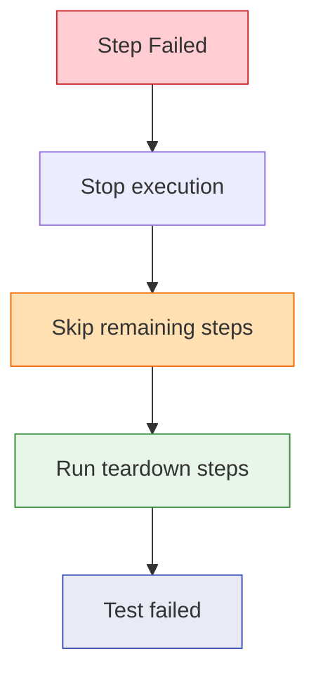

---

## Glossary

| Term | Definition |
|------|-----------|
| **Test** | A YAML file defining a single test (`kind: test`): its target dataspace version, variables, an ordered sequence of steps, and cleanup steps. Identified by `kind: test` or, for backward compatibility, by the presence of a `steps:` key without a `tests:` key. |
| **TCK** | An ordered collection of tests (`kind: tck`), optionally sharing variables, packaged together as one distributable unit. Identified by `kind: tck` or by the presence of a `tests:` key. Supports importing predefined tests with optional overrides. |
| **Kind** | The `kind:` field in a YAML header that explicitly declares the file type: `test` or `tck`. Follows the Kubernetes `kind:` convention. Optional for backward compatibility — the Player can infer the type from the document structure. |
| **Step** | An atomic, named unit of work within a test (e.g., "provision an asset", "negotiate a contract"). Implemented as a Python class registered in the Step Registry. |
| **Step Id** | The `uses:` identifier that maps a step in YAML to its Python implementation (e.g., `connector/provider/create_asset`, `connector/dataplane/http_request`). |
| **Variable** | A named value declared in a test's `variables` block. Can have a default value or be marked `runtime: true` (must be provided at execution time). Steps produce output variables that subsequent steps can consume via `${var_name}` syntax. |
| **Assertion** | An expected-result check attached to a step via the `validate` block. Evaluated after step execution against the step's output. |
| **Compiler** | The component that parses YAML tests, validates them against the Step Registry and declared variables, and stamps metadata. |
| **Package (.tckpkg)** | A ZIP archive containing a manifest, compiled tests, and bundled assets (schemas, sample data). Portable, shareable, versionable. |
| **Player** | The singleton async executor that loads packages or raw YAML, creates Jobs, executes tests step-by-step, evaluates assertions, and reports results. |
| **Job** | A stateful execution entity created for every test run. Tracks lifecycle (`QUEUED` → `RUNNING` → `WAITING` → `COMPLETED`), maintains persistent memory across steps and wait/resume cycles, and provides query endpoints for status, memory, and events. |
| **Job Memory** | A persistent key-value store attached to each Job. Survives across all scripts, steps, wait/resume cycles, and cleanup phases. Accessible via `context.job.memory`. |
| **Monitor** | The in-memory state store that tracks execution progress in real-time — queryable for current step, status, timing, assertion results, and job state. |
| **Context** | The per-test runtime state bag (`StepContext`) that holds variables, configuration, the target dataspace version, and service references. Steps read from and write to the context. |
| **Dataspace Version** | The connector protocol version a test targets (e.g., `"jupiter"`, `"saturn"`). Determines which step implementations and SDK services are used. |
| **Typed Executor** | The implementation model of every step: a registered Python class with a declared input contract (`with:` parameters) and output contract (what `returns:` and assertions read). YAML can only invoke registered step ids — never arbitrary SDK functions. |
| **Service** | A managed SDK service instance (e.g., `ConnectorConsumerService`, `ConnectorProviderService`, `AasService`) declared in a test's `services` block. Initialized once before steps execute and reused across steps. |
| **Service Manager** | The component that initializes, caches, and tears down managed SDK service instances based on the test's `services` declarations. |
| **Callback** | An async webhook pattern where the Player starts a temporary HTTP endpoint, sends a request to an external system, transitions the Job to `WAITING` state, and resumes automatically when the external system calls back with a response within a configurable timeout. |
| **Callback Server** | A FastAPI-based HTTP server (standalone or embedded) that hosts ephemeral callback routes mounted dynamically by the Player per test execution. |
| **Listener** | The callback registration created by the `mock/api` step: the mock endpoint's path and HTTP method, plus an `asyncio.Event` that the `mock/wait/http_request` step waits on. |
| **Encrypted Package** | A `.tckpkg` archive whose payload (scripts + assets) is encrypted with AES-256-GCM. Only authorized Players holding the matching RSA private key can decrypt and execute it. |
| **Player Identity** | An RSA key pair assigned to a Player instance. The public key's SHA-256 fingerprint serves as the Player's unique identifier for package authorization. |
| **Key Block** | An entry in the package manifest's `security.authorized_players` list. Contains a Player's fingerprint and the AES content-encryption key wrapped with that Player's RSA public key. |
| **Trust Store** | A directory (`~/.testlab/trusted_compilers/`) containing public keys of Compilers whose package signatures the Player will accept. |
| **Compiler Signature** | An Ed25519 digital signature created by the Compiler over the manifest and encrypted payload. Verified by the Player against the trust store before execution. |
| **Service Binding** | The mechanism by which a step resolves the managed SDK service for its role (provider, consumer, DTR) from the `StepContext` — steps never name their service in parameters. |
| **Service Resolution** | How a step's service dependency is satisfied: the first seeded service matching the role's `ServiceType` is initialised lazily, cached, and injected; a missing service raises `ServiceNotFoundError`. |
| **Package Upload** | The ability to upload `.tckpkg` files (encrypted or plain) to the testlab server via `POST /api/v1/packages`. Uploaded packages are stored on the server and can be referenced by `package_id` in `/run` requests. |
| **Package Storage** | The server-side directory (default: `~/.testlab/packages/`) where uploaded packages are persisted and indexed by `package_id` (`name-version`). |
| **Vault Backend** | An optional integration with HashiCorp Vault's KV v2 secrets engine for centralized key management. When configured, signing keys and Player keys are stored in and retrieved from Vault instead of the local filesystem. |
| **Configuration** | The `TestlabConfig` settings model that resolves configuration from `testlab.config.yaml`, environment variables, and CLI flags with defined precedence (CLI > env > file > defaults). |
| **Dependency (`depends_on`)** | A list of test names or file references that must complete successfully before this test begins execution. The Player resolves the dependency graph using topological sort. If any dependency fails, the dependent test is skipped. Circular dependencies are detected and raise an error. |
| **File Dependency** | A `depends_on` entry that references an external YAML file (`file: "path.yaml"`) instead of a test name. The parser loads the test from the file, adds it to the TCK, and resolves the reference by name. An optional `outputs` list selects which exports from the file's test to promote. |
| **Output (`outputs`)** | A mapping from export name to context variable name on a test. After successful execution, the Player promotes the referenced variables into the shared tck context so downstream tests can reference them via `${export_name}`. |

---

## NOTICE

This work is licensed under the [CC-BY-4.0](https://creativecommons.org/licenses/by/4.0/legalcode).

- SPDX-License-Identifier: CC-BY-4.0
- SPDX-FileCopyrightText: 2025, 2026 Contributors to the Eclipse Foundation
- SPDX-FileCopyrightText: 2025, 2026 Catena-X Automotive Network e.V.
- Source URL: [https://github.com/eclipse-tractusx/tractusx-sdk](https://github.com/eclipse-tractusx/tractusx-sdk)