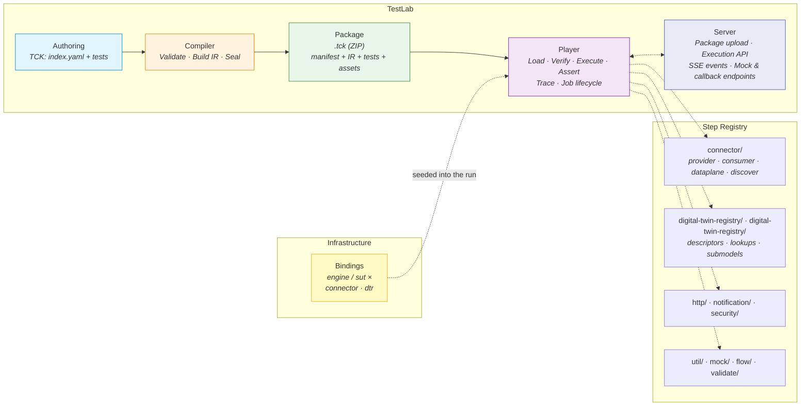
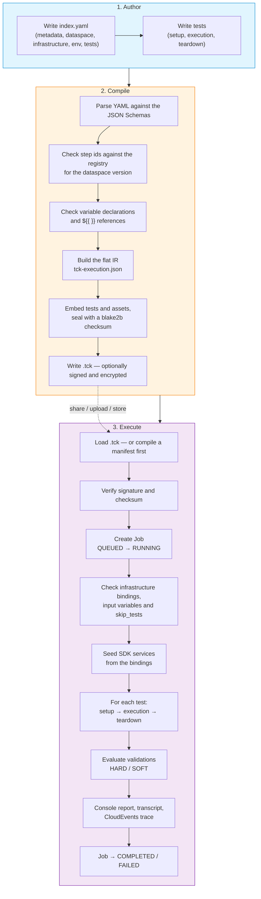
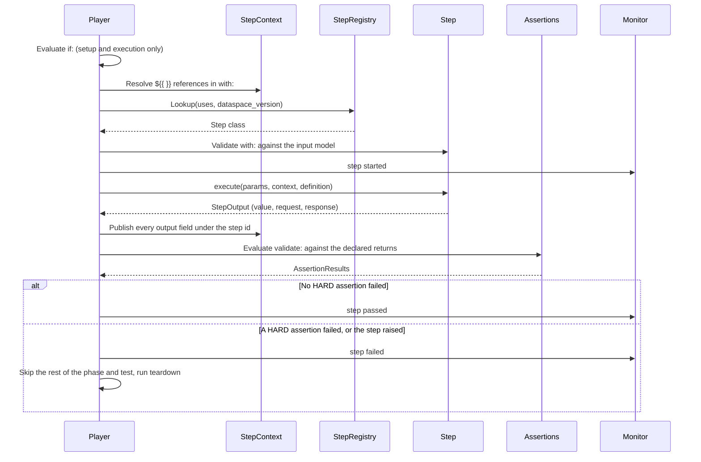
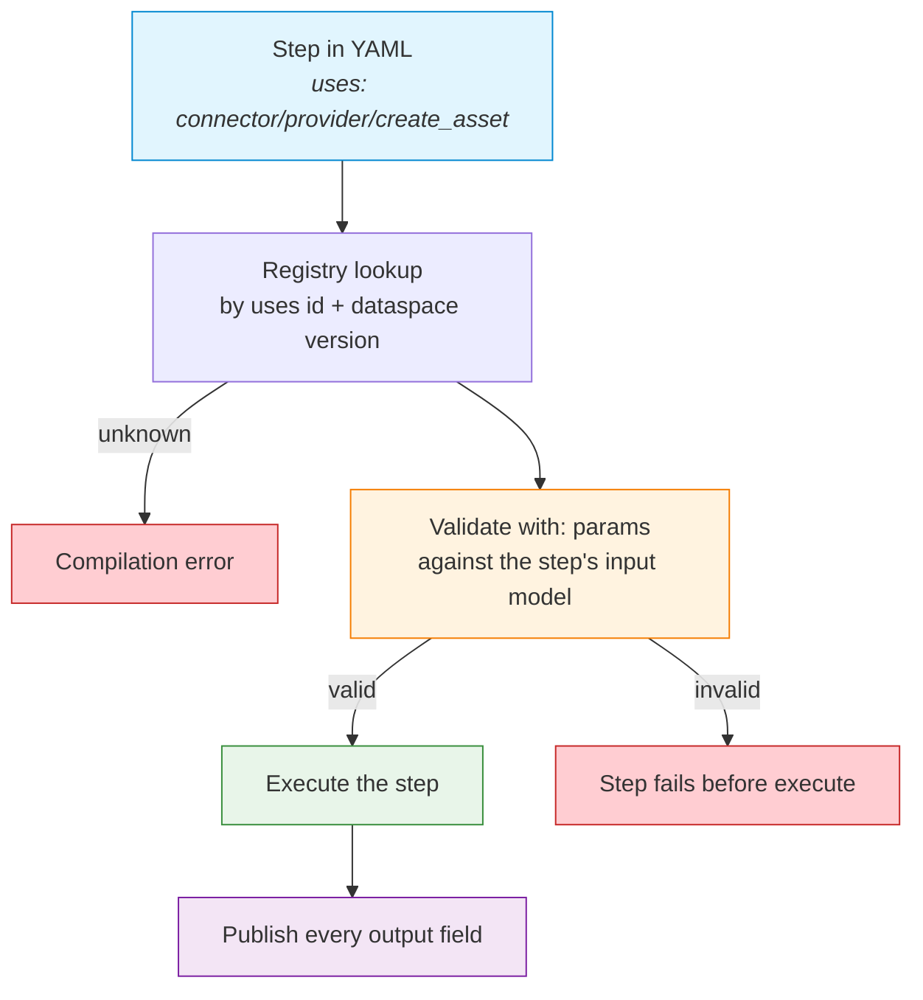
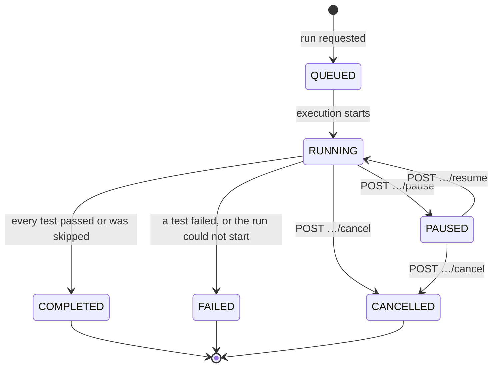
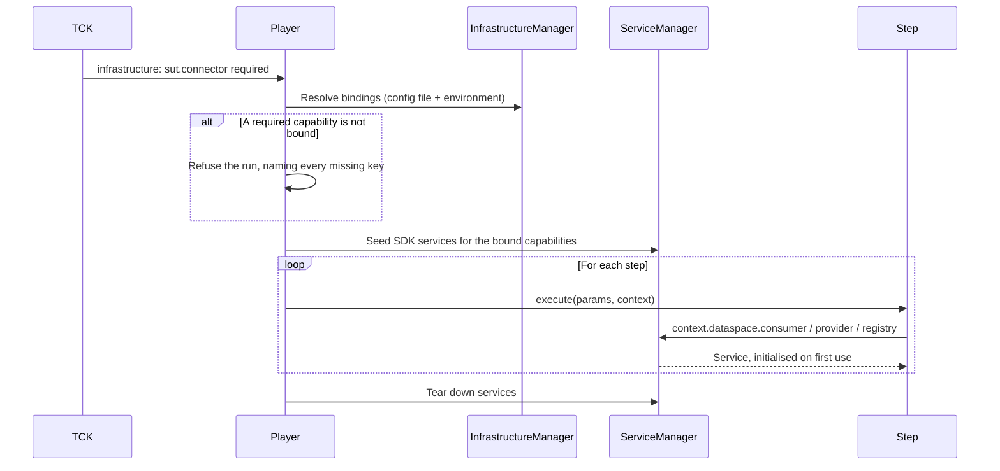
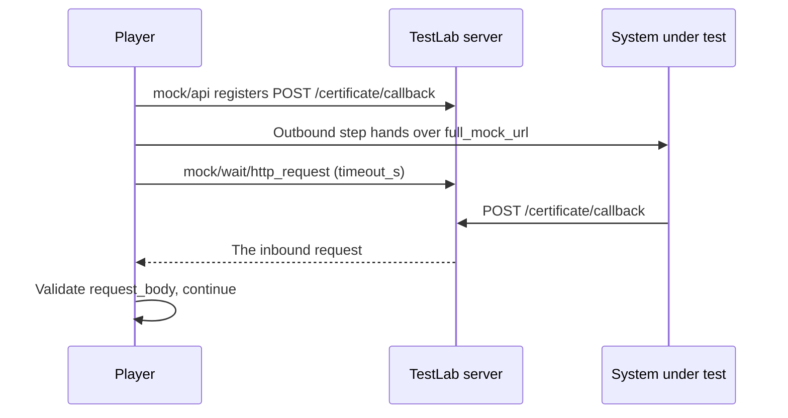
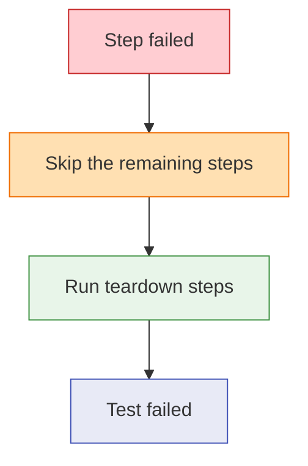

<!--

Eclipse Tractus-X - Tractus-X TestLab

Copyright (c) 2026 Catena-X Automotive Network e.V.
Copyright (c) 2026 Contributors to the Eclipse Foundation

See the NOTICE file(s) distributed with this work for additional
information regarding copyright ownership.

This work is made available under the terms of the
Creative Commons Attribution 4.0 International (CC-BY-4.0) license,
which is available at
https://creativecommons.org/licenses/by/4.0/legalcode.

SPDX-License-Identifier: CC-BY-4.0

-->

# Concepts & Terminology

## Conceptual Model

TestLab is composed of five layers — Authoring, Compilation, Packaging, Execution, and Server — supported by a
registry of typed steps and the infrastructure bindings a run is given.

## Lifecycle Flow

The lifecycle spans three phases: **Author** → **Compile** → **Execute**. Each produces artifacts consumed by the next.

## Step Execution Detail

Within the Player, each step follows this sequence:

## Typed Step Execution

Every step is a **typed executor** registered in the Step Registry under its `uses:` id, optionally for specific
dataspace versions only. Each declares an input model (its `with:` parameters) and an output model (what `returns:`
and assertions read); the [Step Reference](../../api-reference/steps/index.md) is generated from them.

- **At compile time**, `uses:` must resolve to a registered step and every `${{ }}` reference must name something the TCK supplies.
- **At run time**, `with:` is validated against the input model before the step executes. Input models forbid unknown
  keys, so a misspelled parameter fails the step with a message naming the field.

**Security model:** there is no generic "call any SDK function" step — SDK access happens only inside step
implementations, so a YAML test can never invoke arbitrary code.

## Job-Based Execution Model

Every TCK execution — from `testlab run`, the server, or `TestlabPlayer` — is a **Job** with a unique `job_id`, its
runtime variables, a memory store, an event log, and on completion the `TckResult`.

### Job Lifecycle

`JobStatus` also defines `WAITING` and `TIMED_OUT`. In `1.0.0a3` no step moves a job into them: a step waiting for a
callback (`mock/wait/http_request`) keeps the job `RUNNING` and reports a `step.waiting` event, and a wait that times
out fails its step.

A pause takes effect between steps of the setup and execution phases; teardown cannot be paused.

### Job Queries

| Query | API | Returns |
|-------|-----|---------|
| List jobs | `GET /testlab/tck-execution?status=` | Every job with its status and timing |
| Job detail | `GET /testlab/tck-execution/{job_id}` | Full job state, memory, and the result once finished |
| Live events | `GET /testlab/tck-execution/{job_id}/stream` | Server-Sent Events |
| Pause / resume / cancel | `POST /testlab/tck-execution/{job_id}/pause`, `/resume`, `/cancel` | The new status |

## Infrastructure Bindings and Services

A TCK never names the systems it talks to. Its `infrastructure` block declares which capabilities each side must
have — `connector` and `dtr`, on the `engine` side (TestLab's own) and the `sut` side (the system under test) — and
the operator binds them in `testlab.config.yaml` or `TESTLAB_<SIDE>_<CAPABILITY>_<FIELD>` environment variables
([ADR-0019](../../developer/decision-records/backend/ADR-0019-service-requirements-and-engine-bindings.md)).

- Steps never name a service. A connector step addresses the bound SUT connector unless `counter_party_address` /
  `counter_party_id` say otherwise.
- Bound values are readable in a test as `${{ infrastructure.<side>.<capability>.<field> }}`.
- Services are seeded once at run start and live for the whole run.

## Mock Server and Callbacks

For behaviour where the SUT must call TestLab — notification acknowledgments, callbacks, a mocked registry — a test
registers an endpoint on the TestLab server with `mock/api` (or `mock/dtr`, `mock/discovery`) and hands its
`full_mock_url` to the SUT. `mock/wait/http_request` then blocks until the SUT calls it and publishes the inbound
request as its output.

- `testlab run` and `TestlabPlayer` start the server in a background thread on `server_port` (default `8100`) for the
  duration of the run; under `testlab serve` the same app serves them.
- If the request does not arrive within `timeout_s`, the step fails. Mock registrations last for the run.

## Deployment Modes

| Mode | Entry Point | Use Case |
|------|-------------|----------|
| **CLI** | `testlab run <index.yaml or .tck>` | Local runs, CI/CD pipelines |
| **Server** | `testlab serve [--port]` | Remote compile, run and job control over the HTTP API, with live SSE events |
| **Library** | `TestlabPlayer(config).run(path)` | Embedding TestLab in another Python service |

## Package Security

Compiled `.tck` packages can be signed and encrypted so only authorized Players can open them: AES-256-GCM content
encryption, the content key wrapped with RSA-OAEP-SHA256 for each Player, and an Ed25519 Compiler signature. See
[Package Security](security.md).

## Failure Handling

Failure handling is fixed per phase — there is no per-step policy:

| Phase | A failed step… | `if:` honoured | Outputs published |
|-------|----------------|:--------------:|:-----------------:|
| `setup` | stops the phase; `execution` does not run | Yes | Yes |
| `execution` | stops the phase; the remaining steps are skipped | Yes | Yes |
| `teardown` | does not stop it — every teardown step runs | No | No |

Teardown runs after setup and execution whatever their outcome. A `SOFT` validation failure is reported as a warning
and does not fail its step.

---

## Glossary

| Term | Definition |
|------|-----------|
| **TCK** | Test Case Kit: an `index.yaml` manifest (`kind: tck`) plus the tests it lists, run and distributed as one unit. |
| **Test** | One YAML file (`kind: test`) in a TCK: `setup`, `execution` and `teardown` phases of steps. Tests run in manifest order and never read each other's outputs. |
| **Step** | An atomic unit of work within a test, implemented as a registered Python class. |
| **Step id** | The `uses:` value naming a step, `<category>/<module>/<function>` (e.g. `connector/provider/create_asset`). |
| **Variable** | A manifest `env.variables` entry publishing one value, referenced as `${{ env.<id> }}`. `source: value` carries a literal; `source: input` is supplied by the operator and declares `scope: engine` or `scope: sut`. |
| **Validation** | A check in a step's `validate:` block — `validate/assert`, `validate/field` or `validate/schema` — evaluated against the step's declared returns. `HARD` (default) or `SOFT`. |
| **Compiler** | The component that validates a TCK, builds its IR and packages it. |
| **Package (.tck)** | A ZIP archive holding the manifest, the compiled IR, the tests and assets — or, encrypted, a redacted manifest, the encrypted payload and a signature. |
| **IR** | `tck-execution.json`: the flat, compiled representation of every step ([ADR-0014](../../developer/decision-records/backend/ADR-0014-flat-compilation-intermediate-representation.md)). |
| **Player** | `TestlabPlayer`: loads a package, verifies it, creates a Job, executes the tests, and reports results. |
| **Job** | The stateful record of one run: status, runtime variables, memory, events, and the result. |
| **Monitor** | The component that turns execution into events for the console, the trace, and SSE subscribers. |
| **Context** | `StepContext`: the per-test runtime state — variables, job, configuration, infrastructure, and `dataspace` service access. |
| **Dataspace version** | The release a TCK targets (`dataspace.version`, e.g. `saturn`, `jupiter`). Decides which step implementations and SDK services are used. |
| **Infrastructure binding** | The operator-supplied endpoints and identities for a capability (`engine`/`sut` × `connector`/`dtr`), from `testlab.config.yaml` or `TESTLAB_*` variables. |
| **Service** | An SDK service instance (connector consumer/provider, registry) seeded from the bindings and reused for the whole run. |
| **Mock endpoint** | An endpoint registered on the TestLab server by `mock/api`, `mock/dtr` or `mock/discovery` for the SUT to call. |
| **Execution trace** | The CloudEvents JSON-lines record of a run: every step's inputs, outputs, calls and checks ([ADR-0016](../../developer/decision-records/backend/ADR-0016-execution-trace-format.md)). |
| **Transcript** | The plain-text copy of a run's console output. |
| **Skippable test** | A test whose manifest entry says `skippable: true`, which the operator may omit with `skip_tests`. |
| **Encrypted package** | A `.tck` whose content is encrypted for a list of authorized Players and signed by the Compiler. |
| **Identity** | A `testlab keygen` key set: `encryption.{pem,pub}` (RSA-4096) and `signing.{pem,pub}` (Ed25519). |
| **Package storage** | The server directory (`<storage_dir>/packages/`) where uploaded packages are kept by `package_id`. |
| **Configuration** | `TestlabConfig`: settings resolved from defaults, `testlab.config.yaml`, `TESTLAB_*` environment variables, and CLI overrides, in that order. |

---

## NOTICE

This work is licensed under the [CC-BY-4.0](https://creativecommons.org/licenses/by/4.0/legalcode).

- SPDX-License-Identifier: CC-BY-4.0
- SPDX-FileCopyrightText: 2025, 2026 Contributors to the Eclipse Foundation
- SPDX-FileCopyrightText: 2025, 2026 Catena-X Automotive Network e.V.
- Source URL: [https://github.com/eclipse-tractusx/tractusx-sdk](https://github.com/eclipse-tractusx/tractusx-sdk)