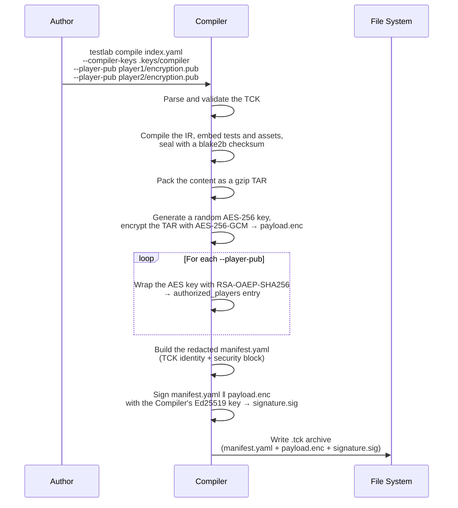
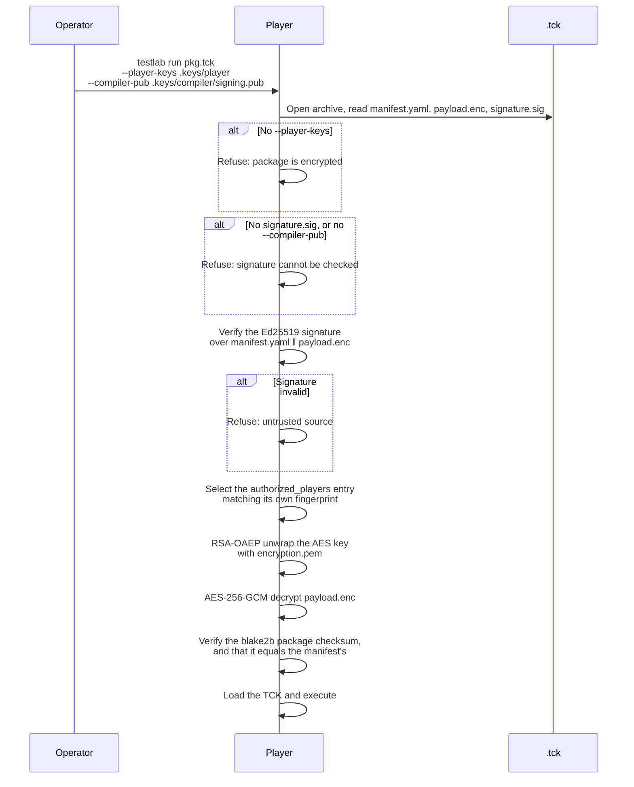

<!--

Eclipse Tractus-X - Tractus-X TestLab

Copyright (c) 2026 Catena-X Automotive Network e.V.
Copyright (c) 2026 Contributors to the Eclipse Foundation

See the NOTICE file(s) distributed with this work for additional
information regarding copyright ownership.

This work is made available under the terms of the
Creative Commons Attribution 4.0 International (CC-BY-4.0) license,
which is available at
https://creativecommons.org/licenses/by/4.0/legalcode.

SPDX-License-Identifier: CC-BY-4.0

-->

# Package Security

## Motivation

Tests can carry sensitive material: service URLs, Business Partner Numbers, policies, and test data that describe the internal topology of a dataspace deployment. If a compiled `.tck` is exfiltrated — through a compromised CI runner, a leaked artifact store, or accidental public upload — everything inside it is exposed.

To mitigate this, `testlab compile` can **sign and encrypt** a package for a named set of Players. An encrypted package can only be opened by a Player holding one of the authorized private keys, and only after its signature has been checked against the Compiler's public key.

Encryption is opt-in: `testlab compile` without keys writes a readable `.tck`. Supply `--compiler-keys` **and** `--player-pub` to encrypt; supplying only one of the two is an error.

!!! note "Secrets do not belong in a TCK"
    Credentials and endpoints of the system under test are infrastructure bindings, supplied by the operator at run time
    (`testlab.config.yaml` or `TESTLAB_*` variables), and values the operator provides are `source: input` variables.
    Encryption protects the test logic and test data; it is not a place to store secrets.

---

## Design Principles

| Principle | Description |
|-----------|-------------|
| **Explicit encryption** | Supplying both `--compiler-keys` and `--player-pub` signs and encrypts the package; supplying neither leaves it readable. There is no third mode. |
| **Compiler-controlled access** | The Compiler decides which Players may decrypt a package by wrapping the content key with each authorized Player's RSA public key. |
| **Signed content** | Every encrypted package is signed with the Compiler's Ed25519 key. A Player refuses to open an encrypted package without the Compiler's public key to verify it against — a signed package is verified or refused. |
| **Sealed content** | Every package, encrypted or not, carries a `blake2b` checksum over all of its entries. A package whose contents differ from the ones it was sealed with is refused. |
| **Minimal metadata exposure** | The `manifest.yaml` of an encrypted package stays readable so tooling can show the TCK identity, checksum, compiler and authorized players. Test files and asset paths are omitted from it. |

---

## Threat Model

| Threat | Scenario | Mitigation |
|--------|----------|------------|
| **Package theft** | An attacker obtains a `.tck` file from CI artifacts, an S3 bucket, or a shared drive. | For an encrypted package, the tests and assets are inside `payload.enc`, encrypted with AES-256-GCM. Without an authorized Player's RSA private key, the content is indecipherable. |
| **Package tampering** | An attacker modifies the payload to inject steps or alter assertions, or edits the readable manifest — its TCK identity, checksum or authorized Players. | The Ed25519 signature covers `manifest.yaml` and `payload.enc` together; AES-GCM authenticates the ciphertext; the `blake2b` package checksum covers every decrypted entry and must equal the checksum the signed manifest states. Any modification is refused. |
| **Unauthorized execution** | An attacker attempts to run a stolen package on their own Player. | The AES content key is wrapped only for the authorized Players' RSA public keys. Any other private key cannot unwrap it. |
| **Compiler impersonation** | An attacker signs a malicious package with their own key. | The Player verifies the signature against the Compiler public key the operator passes (`--compiler-pub`). A package signed by any other key is refused. |
| **Key compromise (Player)** | A Player's RSA private key is leaked. | Generate a new identity and stop authorizing the old public key. Packages already compiled for the old key remain openable with it. |
| **Key compromise (Compiler)** | A Compiler's Ed25519 signing key is leaked. | Generate a new Compiler identity, distribute its `signing.pub` to Players, and re-compile the affected packages. |

---

## Encryption Architecture

### Overview

TestLab uses a **hybrid encryption** scheme:

1. **Content encryption** — AES-256-GCM (symmetric) encrypts the compiled package content into `payload.enc`.
2. **Key wrapping** — RSA-OAEP with SHA-256 (MGF1-SHA256) wraps the AES key individually for each authorized Player.
3. **Package signing** — Ed25519 signs the readable `manifest.yaml` together with `payload.enc`, so the manifest stays
   unencrypted yet cannot be changed.

A single random AES key encrypts the content regardless of how many Players are authorized; each Player receives a copy of that key wrapped with its own RSA public key.

### Encryption Flow (Compile-time)



### What the Signature Covers

`signature.sig` is a base64 Ed25519 signature over the exact bytes of both other archive entries:

```text
"tractusx-testlab/tck-signature/v1" 0x00 ‖ len(manifest.yaml) as 8-byte big-endian ‖ manifest.yaml ‖ payload.enc
```

The fixed prefix keeps a package signature from being valid for anything else the key signs, and the length prefix fixes
the boundary between the two entries. The manifest therefore carries no `signature` field: a signature cannot be part of
the bytes it signs.

Because the manifest is signed as it is stored, anyone holding the Compiler's `signing.pub` can confirm that the
readable manifest — TCK identity, `package.checksum`, `compiler_id`, authorized Players — is the one the Compiler
wrote, without a Player key. A Player then also checks that the checksum of the decrypted content equals the checksum
that manifest states, so the manifest's description is the package.

### Decryption Flow (Player-side)



The decrypted content is unpacked into a temporary directory for loading.

### Manifest of an Encrypted Package

```yaml
kind: manifest
package:
  format: tck
  format_version: 1.0.0
  testlab: v1-alpha
  checksum: blake2b:36431aa4…
  encrypted: true
  allow_asset_override: false
tck:
  id: my-first-tck
  metadata: { name: My First TCK, version: "1.0" }
compilation:
  compiled_at: "2026-09-12T21:43:34Z"
  compiler_version: …
  fingerprint: { nonce: "blake2b:…", public_key: "ed25519:…", digest: "blake2b:…" }
security:
  algorithm: AES-256-GCM
  key_derivation: RSA-OAEP-SHA256
  compiler_id: 15e6377e…          # SHA-256 of the Compiler's signing.pub
  authorized_players:
    - player_id: bb6fcab0…        # SHA-256 of the Player's encryption.pub
      encrypted_key: pRdVuTMH…    # base64 RSA-OAEP-wrapped AES key
```

### Inspection and Extraction

`testlab inspect` performs the same checks as `testlab run` before it reports anything, and `--extract` writes the verified contents to a directory:

```bash
testlab inspect my-first-tck.tck \
  --player-keys .keys/player \
  --compiler-pub .keys/compiler/signing.pub \
  --extract ./extracted
```

| Flag | Required | Description |
|------|----------|-------------|
| `--player-keys` / `-k` | If encrypted | Directory containing the Player identity (`encryption.pem`). |
| `--compiler-pub` / `-c` | If encrypted | Path to the Compiler's Ed25519 public key (`signing.pub`). |
| `--extract <dir>` | No | Write the verified contents to a directory. Without it, `inspect` only reports. |

If any check fails, the command aborts and nothing is written — including the report itself, so a tampered package's own account of what it contains is never shown.

| Actor | Can read the content? |
|-------|-----------------------|
| **Authorized Player** (with the Compiler public key) | Yes — `testlab run`, `testlab inspect`, `testlab inspect --extract` |
| **Anyone else** | No — only the redacted `manifest.yaml` |
| **Anyone, unencrypted package** | Yes — it is a ZIP archive |

---

## Key Management

### Identity Model

`testlab keygen` generates one identity: an RSA-4096 key pair for encryption **and** an Ed25519 key pair for signing. The same command serves both roles — a Compiler uses the signing pair, a Player uses the encryption pair.

| Key file | Algorithm | Used by | Purpose |
|----------|-----------|---------|---------|
| `encryption.pem` / `encryption.pub` | RSA-4096 (PKCS#8 / SPKI PEM) | Player | Unwrap the AES content key; the `.pub` is what a Compiler authorizes |
| `signing.pem` / `signing.pub` | Ed25519 (PKCS#8 / SPKI PEM) | Compiler | Sign packages; the `.pub` is what a Player verifies against |

Fingerprints are the SHA-256 hex digest of the PEM-encoded public key. They appear as `player_id` and `compiler_id` in the manifest.

### Key Generation

```bash
# On the compiling machine
testlab keygen --out-dir .keys --label compiler
# → .keys/compiler/{encryption,signing}.{pem,pub}

# On each Player machine
testlab keygen --out-dir .keys --label player
# → .keys/player/{encryption,signing}.{pem,pub}
```

| Option | Default | Description |
|--------|---------|-------------|
| `--out-dir` / `-o` | `.keys` | Parent directory; keys are written to `<out-dir>/<label>/` |
| `--label` / `-l` | `default` | Name of the identity's subdirectory |
| `--override-keys` | off | Regenerate even if keys already exist. Without it, existing keys are reused. |

Share `encryption.pub` from each Player with the Compiler, and `signing.pub` from the Compiler with each Player. Keep the `.pem` files private: `keygen` writes them with the process's default file permissions, so restrict them yourself (for example `chmod 600 .keys/*/*.pem`).

### Key Rotation

| Scenario | Procedure |
|----------|-----------|
| **Rotate a Player key** | `testlab keygen --label player --override-keys`. Share the new `encryption.pub` with the Compiler; packages compiled for the old key need the old key. |
| **Rotate the Compiler key** | `testlab keygen --label compiler --override-keys`. Distribute the new `signing.pub` to Players and re-compile the affected packages. |
| **Revoke a Player** | Stop passing its `encryption.pub` to `--player-pub`. Packages already compiled for it remain decryptable by it. |
| **Revoke a Compiler** | Stop passing its `signing.pub` to `--compiler-pub`. |

### Keys on a Server

The CLI takes keys per command (`--player-keys`, `--compiler-pub`). A server or an embedded `TestlabPlayer` cannot be
handed a private key per request, and is not: the engine *is* the Player, so it reads its own identity and the
Compilers it accepts from its settings.

| Setting | Default | Holds |
|---------|---------|-------|
| `keys_dir` / `TESTLAB_KEYS_DIR` | `~/.testlab/keys` | The engine's Player identity — the directory `testlab keygen` wrote, with `encryption.pem` directly inside |
| `trust_store_dir` / `TESTLAB_TRUST_STORE_DIR` | `~/.testlab/trusted_compilers` | One `signing.pub` per trusted Compiler, under any file name ending in `.pub` |

For an encrypted package the engine unwraps the key with `<keys_dir>/encryption.pem` and verifies the signature
against the trusted key whose fingerprint equals the manifest's `compiler_id`. A package signed by a Compiler that is
not in the trust store is refused. The `vault` block (`vault_url`, `vault_token`, `vault_secret_path`) is declared but
not read in `1.0.0a3`.

```bash
testlab keygen --out-dir /etc/testlab --label player
mkdir -p /etc/testlab/trusted_compilers && cp compiler-signing.pub /etc/testlab/trusted_compilers/
export TESTLAB_KEYS_DIR=/etc/testlab/player
export TESTLAB_TRUST_STORE_DIR=/etc/testlab/trusted_compilers
testlab serve
```

---

## Compilation Modes

`--plain` (directory instead of archive) and encryption (keys supplied or not) are independent choices:

| Command | Output |
|---------|--------|
| `testlab compile index.yaml` | Readable `.tck` archive |
| `testlab compile index.yaml -c <compiler-dir> -p <player.pub> [-p …]` | Signed and encrypted `.tck` archive |
| `testlab compile index.yaml --plain` | Readable loose files in a directory (default `<manifest dir>/plain`) |
| `testlab compile index.yaml --plain -c <compiler-dir> -p <player.pub>` | Encrypted loose files in a directory |

If only one of `--compiler-keys` / `--player-pub` is supplied, compilation stops:

```
Error: --player-pub is required to encrypt a package. Supply both --compiler-keys and --player-pub, or neither.
```

### Mode Comparison

| Aspect | Encrypted `.tck` | Unencrypted `.tck` |
|--------|:----------------:|:------------------:|
| Tests readable? | No | Yes |
| Requires Player key to run? | Yes | No |
| Requires Compiler public key to run? | Yes | No |
| Archive entries | `manifest.yaml`, `payload.enc`, `signature.sig` | `manifest.yaml`, `tck-bundle.yaml`, `tck-execution.json`, `tests/`, `assets/` |
| Checksum verified at load? | Yes | Yes |

---

## CLI Reference

| Command | Description |
|---------|-------------|
| `testlab keygen [-o <dir>] [-l <label>] [--override-keys]` | Generate an RSA-4096 + Ed25519 identity in `<dir>/<label>/` |
| `testlab compile <index.yaml> [-o <file>]` | Compile an unencrypted `.tck` |
| `testlab compile <index.yaml> -c <compiler-dir> -p <player.pub> [-p …]` | Compile a signed, encrypted `.tck` for the listed Players |
| `testlab run <pkg.tck> -k <player-dir> --compiler-pub <signing.pub>` | Run an encrypted package |
| `testlab inspect <pkg.tck> [-k <player-dir> -c <signing.pub>] [--manifest]` | Report what a package contains |
| `testlab inspect <pkg.tck> [-k … -c …] --extract <dir>` | Write the verified contents to a directory |

---

## Error Messages

| Message | Cause | Resolution |
|---------|-------|------------|
| `Package '<name>' is encrypted — provide --player-keys to load it.` | No player identity supplied | Pass `--player-keys` |
| `Encrypted package '<name>' is signed, but no compiler public key was supplied to check it against. Pass --compiler-pub.` | No Compiler public key supplied | Pass `--compiler-pub` (`-c` for `inspect`) |
| `Encrypted package '<name>' carries no signature.` | `signature.sig` missing | Re-obtain the package from the Compiler |
| `Package signature verification failed — untrusted source. …` | Signed by another key, or `manifest.yaml` or `payload.enc` changed | Check you have the right `signing.pub`; otherwise the package was tampered with |
| `The package manifest does not describe its payload: …` | The signed manifest states a different checksum than the decrypted content carries | Re-obtain the package from the Compiler |
| `Encrypted .tck has no authorized_players in manifest.` | Malformed package | Re-compile |
| `This package was not compiled for this player: …` | The Player's `encryption.pub` was not passed to `--player-pub` | Ask the Compiler to re-compile with it |
| `Package '<name>' is encrypted, and this engine has no player identity: …` | Server: no `encryption.pem` in `keys_dir` | Set `TESTLAB_KEYS_DIR` |
| `Package '<name>' is signed by compiler <id>, which this engine does not trust. …` | Server: the Compiler's `signing.pub` is not in `trust_store_dir` | Copy it there |
| `Error: --player-pub is required to encrypt a package. …` | Only one of the two key options supplied | Supply both, or neither |

---

## NOTICE

This work is licensed under the [CC-BY-4.0](https://creativecommons.org/licenses/by/4.0/legalcode).

- SPDX-License-Identifier: CC-BY-4.0
- SPDX-FileCopyrightText: 2025, 2026 Contributors to the Eclipse Foundation
- SPDX-FileCopyrightText: 2025, 2026 Catena-X Automotive Network e.V.
- Source URL: [https://github.com/eclipse-tractusx/tractusx-testlab](https://github.com/eclipse-tractusx/tractusx-testlab)