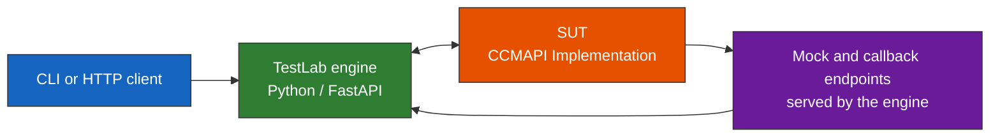
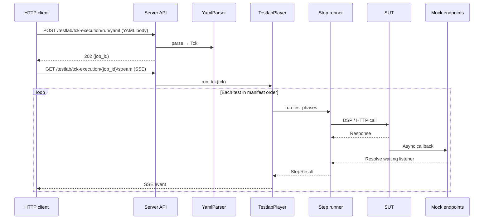
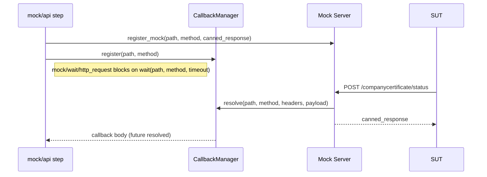
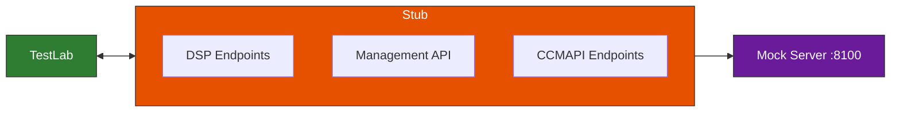

<!--
 Eclipse Tractus-X - Tractus-X TestLab

 Copyright (c) 2026 Contributors to the Eclipse Foundation

 See the NOTICE file(s) distributed with this work for additional
 information regarding copyright ownership.

 This program and the accompanying materials are made available under the
 terms of the Apache License, Version 2.0 which is available at
 https://www.apache.org/licenses/LICENSE-2.0.

 Unless required by applicable law or agreed to in writing, software
 distributed under the License is distributed on an "AS IS" BASIS, WITHOUT
 WARRANTIES OR CONDITIONS OF ANY KIND, either express or implied. See the
 License for the specific language governing permissions and limitations
 under the License.

 SPDX-License-Identifier: Apache-2.0
-->
<!-- This documentation was partially generated using artificial intelligence (AI) (Tool: Copilot, Model: Claude Opus 4.6). -->
<!-- It was reviewed and tested by a human committer. -->

# Company Certificate Management — Architecture Guide

This guide explains the system architecture, execution design, and extension points of the CX-0135 conformity test suite.

## System Architecture

Three components collaborate during a test run:



| Component | Technology | Role |
|-----------|-----------|------|
| **TestLab engine** | Python 3.12, FastAPI (this repository) | The `testlab` CLI and server: compiling and validating TCKs, running tests, executing steps, streaming execution events over SSE |
| **Mock and callback endpoints** | The engine's FastAPI server | Callback endpoints and canned responses for inbound SUT calls — started in a background thread during `testlab run`, or hosted by `testlab serve` |
| **SUT** | Any CX-0135 implementation | The system being validated |

For the engine's full package layout and import graph, see [Architecture](../developer/architecture.md).

## Execution Architecture

A run starts either from the CLI (`testlab run`, which compiles the manifest into a `.tck` package and executes it) or from an HTTP client of the server. Over HTTP, this sequence runs:



### Client → Server handoff

1. The client sends the TCK as YAML to `POST /testlab/tck-execution/run` (or `/run/yaml`), or uploads a compiled package to `POST /testlab/run/package`
2. The server returns HTTP 202 with a `job_id`
3. The client opens an SSE stream at `GET /testlab/tck-execution/{job_id}/stream` (resumable via `Last-Event-ID`)
4. The server emits execution events such as `step.started`, `step.completed`, and `step.failed` as they happen

### Engine orchestration

1. `YamlParser` deserializes the YAML into a `Tck` object (metadata + variables + test references)
2. Each test reference resolves to a `Test` (setup, test and cleanup phases)
3. The `TestlabPlayer` binds the configured infrastructure, seeds the SDK services, and runs the tests in the order the manifest lists them
4. For each test: run setup → run the test's steps → run cleanup (even if the test's steps fail)
5. Per step: resolve `${{ }}` references → execute the step → evaluate `validate:` assertions → publish the step's declared `returns:` outputs into the run context

## Test Orchestration Design

### Test order

Tests run in the order the manifest lists them. There is no inter-test dependency declaration in `v1-alpha`: a test says what it needs through the infrastructure it requires and the variables it reads, not by naming another test. An operator can skip individual tests; the remaining tests keep their manifest order.

### Variable flow

Variables propagate through three mechanisms:

| Mechanism | Scope | Example |
|-----------|-------|---------|
| Declared `returns:` outputs | Published automatically to the run context after each step | `connector/dataplane/http_request` publishes `status_code` and `response_body`; later steps read `${{ execution.<step_id>.<output> }}` |
| `store_in_variable` parameter | Explicit capture into a named context variable (on util steps such as `util/json_path_extract`, `util/base64`, `util/parse_kv`) | `util/json_path_extract` stores `ccmapi_asset_id` |
| Shared run context | Across tests | Tests run in manifest order against one run context, so a later test can read what an earlier test stored |

Steps reference variables with `${{ }}` interpolation (e.g. `${{ env.sut_counter_party_address }}` or `${{ execution.pull_ccmapi_endpoint.edr_token }}`). The step runner resolves them from the execution context before calling the step executor.

### Callback handling

The CCM suite uses asynchronous callbacks: the SUT processes a request and later POSTs a status update to a TestLab endpoint. The `CallbackManager` handles this:



1. `mock/api` registers an `asyncio.Future` for a specific HTTP path
2. A subsequent `mock/wait/http_request` step blocks waiting for the future to resolve
3. When the SUT sends an HTTP request to the mock server at that path, the mock server resolves the future
4. The mock server also returns a canned response to the SUT
5. The waiting `mock/wait/http_request` step unblocks with the received callback body

## CX-0135 Compliance Mapping

Each CX-0135 requirement maps to a specific test and step type:

| CX-0135 Requirement | Test | Step Type | What Is Validated |
|---------------------|------|-----------|-------------------|
| §2.1.1.1 REQUEST mechanism | `request_certificate` | `connector/dataplane/http_request` | POST with header+content envelope returns 200 |
| §3.1 Semantic model | `validate_payload` | `validate/schema` | Payload matches BusinessPartnerCertificate v3.1.0 |
| §2.1.1.3 FEEDBACK inbound | `await_feedback_callback` | `mock/wait/http_request` | SUT sends callback to `/companycertificate/status` |
| §2.1.1.3 FEEDBACK outbound | `send_feedback` | `connector/dataplane/http_request` | Feedback notification via EDC data plane |
| §2.1.1.2 PUSH mechanism | `push_certificate` | `connector/dataplane/http_request` | Push via data plane to `/companycertificate/push` |
| §2.1.1.4 AVAILABLE notification | `available_notification` | `connector/dataplane/http_request` | Notification to `/companycertificate/available` |
| §2.1.4.1 Provider asset exposure | `expose_testlab_asset` | `connector/provider/create_asset` + `mock/wait/http_request` | SUT discovers and pulls from TestLab EDC |
| §2.1.1.1.4 Error handling | `error_handling` | `connector/dataplane/http_request` | REJECTED status in response envelope |

### Dataspace protocol mapping

Every test that communicates with the SUT follows the standard EDC flow:

| DSP Phase | TestLab Step Type | Purpose |
|-----------|-------------------|---------|
| Catalog discovery | `connector/consumer/query_catalog` | Find the CCMAPI asset in the provider's catalog |
| Contract negotiation | `connector/consumer/negotiate` | Agree on usage policies (e.g., `cx.ccm.base:1`) |
| Transfer initiation | `connector/consumer/initiate_transfer` | Get an EDR with data plane auth credentials |
| Data plane call | `connector/dataplane/http_request` | Send the actual CCMAPI message via the EDR |

The `connector/consumer/pull_data_filtered` step bundles the first three phases (filtered catalog query, policy check, negotiation, and EDR retrieval) into a single step — the shipped CCM suite uses it.

## Mock Server Architecture

The embedded mock server serves two purposes: it provides canned responses to the SUT and it captures inbound requests for assertion.

### Registration flow

The `mock/api` step type registers both a canned response and a callback future:

```python
# Simplified — actual implementation in steps/mock/api.py
register_mock(path="/companycertificate/status", method="POST", response=canned_body)
callback_manager.register("/companycertificate/status", "POST")
```

When the SUT hits the mock path, the server:

1. Returns the canned response to the SUT (so the SUT sees a valid response)
2. Resolves the future with the request body (so the test step can assert on it)

### mock/wait/http_request

The `mock/wait/http_request` step blocks on the registered future with a configurable timeout. If the SUT never calls back, the step fails with a timeout error.

## SUT Stub Architecture

The stub at `stubs/ccm-sut/` replaces a real EDC connector and CCMAPI service for local testing.

### What the stub replaces



### Endpoint behavior

| Endpoint | Behavior |
|----------|----------|
| `POST /api/v1/dsp/catalog/request` | Returns catalog with 2 datasets: CCMAPI (`ccm-offer-001`) and Submodel (`cert-asset-001`) |
| `POST /api/v1/dsp/negotiations/initial` | Auto-finalizes, returns agreement ID |
| `POST /management/v3/transferprocesses` | Returns static transfer ID |
| `GET /management/v3/edrs/{id}/dataaddress` | Returns EDR: `endpoint=localhost:8090`, `authCode=edr-token-xxx` |
| `POST /companycertificate/request` | Returns `{requestStatus: COMPLETED}` + schedules 10s callback |
| `POST /companycertificate/push` | Returns OK + schedules 1s feedback callback |
| `POST /companycertificate/available` | Returns OK (no callback) |
| `POST /companycertificate/notification/receive` | Returns OK + schedules 1s ack callback |

### Callback mechanism

The stub sends three types of async callbacks to the TestLab mock server:

| Trigger | Callback URL | Delay | Payload |
|---------|-------------|-------|---------|
| `/companycertificate/request` | `/companycertificate/status` | 10s | `{certificateStatus: RECEIVED, documentId}` |
| `/companycertificate/push` | `/companycertificate/status` | 1s | `{certificateStatus: RECEIVED}` |
| `/companycertificate/notification/receive` | `/companycertificate/notification/receive` | 1s | Notification ack |

### Startup consumer simulation

On startup, the stub waits 20s then GETs `{TESTLAB_CALLBACK_URL}/api/v1/companycertificate` to simulate a real SUT pulling TestLab's exposed asset (for `expose_testlab_asset`).

### Extending the stub

Add routes in `app.py`, response builders in `responses.py`. See `stubs/ccm-sut/README.md` for details.

## Extension Points

### Adding a new standard's test suite

1. Create a directory for the suite — the shipped reference lives at `docs/examples/certificate-management-v2/raw/` in this repository
2. Write an `index.yaml` with `kind: tck`, metadata, variables, and test references
3. Write individual test YAML files with `kind: test`
4. Run `testlab validate` on the directory to check it against the schemas and the step registry before compiling it

### Creating custom step executors

Implement a new step executor in `src/tractusx_testlab/steps/` and register it with the `@step()` decorator under a unique id following the `<category>/<module>/<function>` scheme. See [Create a Step Executor](create-step-executor.md).

### Adding new assertion types

Assertions are validation steps (`validate/assert`, `validate/field`, `validate/schema`) that read a step's declared `returns:` outputs and evaluate an operator (e.g., `equals`, `not_null`, `matches_regex`). See [Add an Assertion Type](add-assertion-type.md) for extending them.

### CI/CD integration

Run the test suite headless via CLI:

```bash
testlab run index.yaml --config run-config.yaml
```

The command prints per-test and per-step results to stdout and exits non-zero on failure; the console transcript is written to the `--logs-dir` directory (default `./logs`), and the CloudEvents execution trace to the configured `data_dir`. Use the exit code for pass/fail status in your CI pipeline.

## Design Decisions

| Decision | Rationale | Reference |
|----------|-----------|-----------|
| SSE over WebSocket | Simpler server push, no bidirectional channel needed | [ADR-0003](../developer/decision-records/shared/ADR-0003-sse-for-live-execution.md) |
| YAML over JSON for tests | Human-readable, supports comments, familiar to DevOps | Project convention |
| Manifest order, no inter-test dependencies | A test states what it needs through required infrastructure and the variables it reads, not by naming another test | Player design |
| `asyncio.Future` for callbacks | Native async/await integration, no polling, timeout support | Mock server design |
| `${{ }}` interpolation | GitHub-Actions-style references, explicit about their source (`env.`, `execution.`) | [Specification](../tck-syntax/index.md) |

## Next Steps

- **[Developer Guide](ccm-developer-guide.md)** — Setup, running, and debugging
