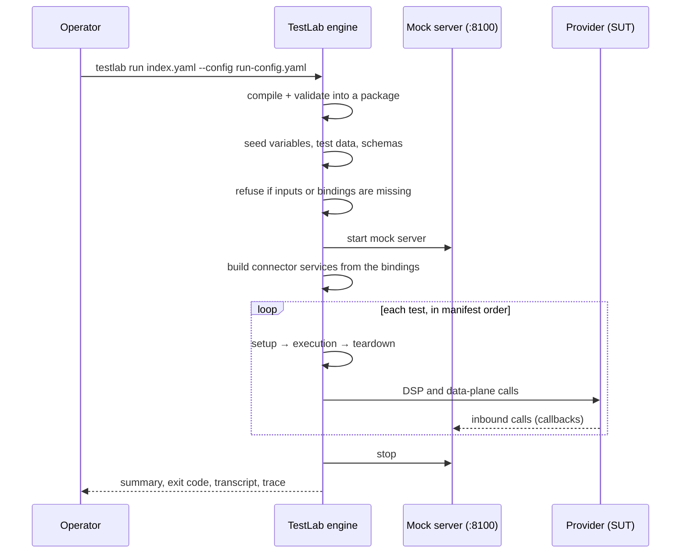
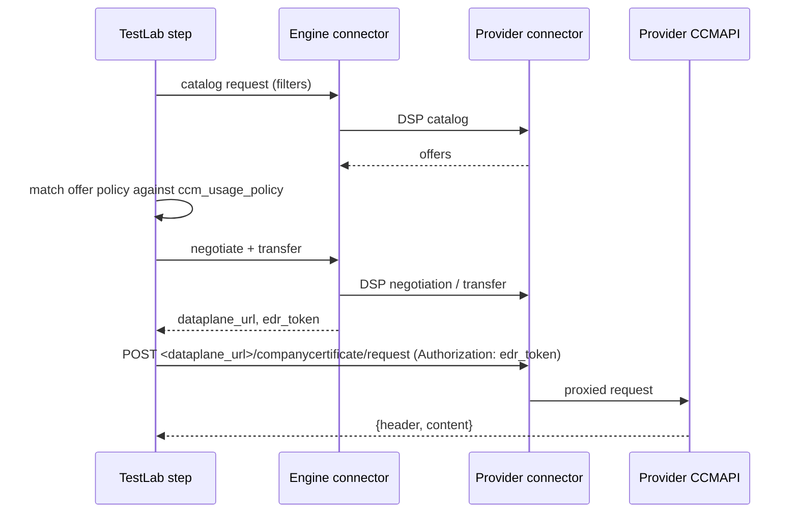
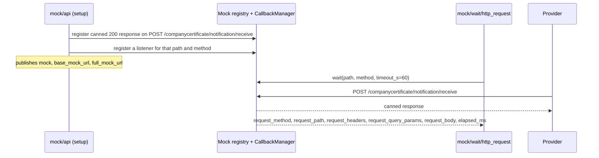

<!--
 Eclipse Tractus-X - Tractus-X TestLab

 Copyright (c) 2026 Contributors to the Eclipse Foundation

 See the NOTICE file(s) distributed with this work for additional
 information regarding copyright ownership.

 This program and the accompanying materials are made available under the
 terms of the Apache License, Version 2.0 which is available at
 https://www.apache.org/licenses/LICENSE-2.0.

 Unless required by applicable law or agreed to in writing, software
 distributed under the License is distributed on an "AS IS" BASIS, WITHOUT
 WARRANTIES OR CONDITIONS OF ANY KIND, either express or implied. See the
 License for the specific language governing permissions and limitations
 under the License.

 SPDX-License-Identifier: Apache-2.0
-->
<!-- This documentation was partially generated using artificial intelligence (AI) (Tool: Claude Code, Model: Claude Opus 5). -->
<!-- It was reviewed and tested by a human committer. -->

# Certificate Management — Architecture Guide

This page explains how the Certificate Management TCK is built. It covers how the manifest and the tests fit together, what happens to them during a run, and the two interaction patterns the suite uses: a data-plane call through a negotiated connector, and an inbound call caught by a mock. It uses the suite as a template. For the engine's internals, see [Architecture](../developer/architecture.md).

## Suite layout

```text
docs/examples/certificate-management-v2/raw/
├── index.yaml                                   # the TCK manifest
├── tests/
│   ├── catalog_policy_validation.yaml
│   ├── request_certificate.yaml
│   ├── send_feedback_notification.yaml
│   └── error_handling.yaml
├── schemas/
│   └── business_partner_certificate_schema-v3.0.1.json
└── testdata/
    ├── request_certificate_body.json
    ├── send_feedback_body.json
    └── error_unknown_cert_type_body.json
```

The sibling folders `plain/`, `encrypted/` and `execution/` hold sample compiler and player output for the packaging docs. A run does not read them.

## The manifest

`index.yaml` is the only file that states what the suite needs. Tests have no `env:` of their own. They join the manifest through `namespace: certificate-management-tck-v0.0.1`.

| Block | Content in this suite | Role |
| --- | --- | --- |
| `metadata` | Name, version `v0.0.1`, authors, `standards: [{id: CX-0135, version: v3.1.0}]` | What the report says the run certifies |
| `dataspace` | `ecosystem: Catena-X`, `version: saturn` | Picks the connector dialect the engine builds its SDK services with |
| `infrastructure` | `engine.connector` and `sut.connector`, both `required: true`, standard CX-0018 v4.2.0 | The capabilities an operator must bind before the first step |
| `env.variables` | `sut_counter_party_id`, `sut_counter_party_address` (`source: input`, `scope: sut`), `ccm_usage_policy` (`config/connector/policy`, `source: value`) | Values the tests read as `${{ env.<id> }}` |
| `env.schemas` | `certificate_schema` | Read as `${{ env.schemas.certificate_schema }}` |
| `env.testdata` | `request_certificate_body`, `send_feedback_body`, `error_unknown_cert_type_body` | Read as `${{ env.testdata.<id> }}`; references inside a file are resolved when a step reads it |
| `tests` | Four entries, each `{id: <file name>, name: …}` | The run order |

The usage policy is declared once, in the simplified policy form, and each test hands the whole variable to the connector step:

```yaml
- id: ccm_usage_policy
  uses: config/connector/policy
  name: Required CCMAPI Usage Policy
  with:
    source: value
    value:
      permissions:
        - action: use
          constraints:
            and:
              - left_operand: UsagePurpose
                operator: isAnyOf
                right_operand: "cx.ccm.base:1"
              - left_operand: FrameworkAgreement
                operator: eq
                right_operand: "DataExchangeGovernance:1.0"
  returns:
    value:
      type: object
      class: Policy
```

A test has two identifiers. The manifest entry id is the file name (`request_certificate.yaml`), which is what `skip_tests` would name. The test document's own `id:` (`request-certificate`) is what the console, the events and the trace carry.

## How a run proceeds



Two design rules shape every test:

- **No test names a connector service.** The engine builds the consumer and provider services from `infrastructure.engine.connector` when the run starts. A connector step reaches them through the run, not through a `with:` key.
- **Tests do not depend on each other.** Each test does its own discovery and negotiation. `v1-alpha` has no inter-test dependency, and references resolve backwards within one test only (plus `env`). A test can therefore be read, and fail, on its own.

## Test anatomy

Every test file has the same header and up to three phases:

```yaml
kind: test
syntax: v1-alpha
namespace: certificate-management-tck-v0.0.1
id: request-certificate
metadata:
  name: "Request Certificate"
  version: "v1.0.0"
setup: []       # steps without validate:, e.g. registering a mock
execution: []   # the steps under test, each with its validate: checks
teardown: []    # cleanup; runs even when execution failed
```

Within `execution`, a step runs only if every check before it passed. The first failed hard check aborts the test. Only *Send Feedback Notification* uses `setup`. No test needs `teardown`, because the suite provisions no assets, policies or contract definitions on either connector.

Every step in the suite uses the keys `id`, `uses`, `name`, `with`, `returns` and `validate`. Its outputs are published under `${{ execution.<step-id>.<field> }}` (or `setup.<step-id>.<field>`) for the steps after it. Its checks name those outputs directly with `input:`.

| Check | Used for |
| --- | --- |
| `validate/assert` | Compare a whole output: `edr_token` not null, `status_code` equals 200 |
| `validate/field` | Compare a value at a `path` inside an output: `header.messageId` matches a UUID URN |
| `validate/schema` | Validate an output against a declared JSON Schema |

The operators are listed in [Validations](../api-reference/steps/validations.md).

## Pattern 1: a call through the connector

Every test starts the same way. It discovers the CCMAPI offer, negotiates it under the usage policy, and obtains data-plane credentials, all in one step:

```yaml
- id: pull_ccmapi_endpoint
  uses: connector/consumer/pull_data_filtered
  name: Discover CCMAPI offer and obtain dataplane credentials
  with:
    counter_party_address: "${{ env.sut_counter_party_address }}"
    counter_party_id: "${{ env.sut_counter_party_id }}"
    expected_policies: "${{ env.ccm_usage_policy }}"
    filters:
      - operand_left: "https://w3id.org/edc/v0.0.1/ns/type"
        operator: "="
        operand_right: "https://w3id.org/catenax/taxonomy#CCMAPI"
      - operand_left: "http://purl.org/dc/terms/subject"
        operator: "="
        operand_right: "https://w3id.org/catenax/taxonomy#CompanyCertificateManagementNotificationApi"
      - operand_left: "https://w3id.org/catenax/ontology/common#version"
        operator: "="
        operand_right: "3.0"
  returns:
    edr_token:
      type: string
      class: AuthToken
    dataplane_url:
      type: string
  validate:
    - uses: validate/assert
      with: { input: edr_token, operator: not_null }
    - uses: validate/assert
      with: { input: dataplane_url, operator: not_null }
```

The step's reference is [`connector/consumer/pull_data_filtered`](../api-reference/steps/connector/consumer.md#connector-consumer-pull_data_filtered). It requests the provider's catalog with the three filters and compares each offer with `expected_policies`. It accepts an offer only on a full match, then negotiates, transfers and returns the data-plane pair `dataplane_url` / `edr_token`, together with `token_prefix`, `catalog` and `datasets`. When `counter_party_address` and `counter_party_id` are omitted, the step uses `infrastructure.sut.connector.dsp_url` and `.participant_id`. This suite passes them explicitly from its declared inputs.

The CCMAPI call then goes through the provider's data plane with those two outputs:

```yaml
- id: request_certificate
  uses: connector/dataplane/http_request
  name: POST certificate request to CCMAPI endpoint via dataplane
  with:
    method: POST
    dataplane_url: "${{ execution.pull_ccmapi_endpoint.dataplane_url }}"
    path: "/companycertificate/request"
    edr_token: "${{ execution.pull_ccmapi_endpoint.edr_token }}"
    headers:
      Content-Type: "application/json"
    body: "${{ env.testdata.request_certificate_body }}"
  returns:
    status_code:
      type: integer
    response_body:
      type: object
      class: ResponseBody
```



`status_code` and `response_body` are response fields that every HTTP-calling step exposes. The CX-0135 message bodies come from `testdata/`, so a test holds only the parts that change the verdict.

A negative test uses the same two steps. *Error Handling* marks its data-plane step `expects: fail`. The marker is declarative: it records that the provider must refuse this request, and the refusal itself is checked by `validate:` (HTTP 200 with `content.requestStatus` equal to `REJECTED`). A rejection is an application-level answer, not a transport failure, so the step's outcome is not inverted.

## Pattern 2: an inbound call

*Send Feedback Notification* checks a message that the provider sends to TestLab, after TestLab has sent one to the provider. Two mock steps handle it:

```yaml
setup:
  - id: mock_receive_ack
    uses: mock/api
    with:
      method: POST
      path: "/companycertificate/notification/receive"
      response_status: 200
      response_body: "${{ env.testdata.send_feedback_body }}"
    returns:
      mock:
        type: class
        class: MockInstance
      full_mock_url:
        type: string

execution:
  # … pull_ccmapi_endpoint, send_status_notification …
  - id: wait_provider_ack
    uses: mock/wait/http_request
    with:
      mock: "${{ setup.mock_receive_ack.mock }}"
      timeout_s: 60
```



The mock server is started by the player before the first test. It listens on `server_port` (default `8100`) and is stopped after the last test. [`mock/api`](../api-reference/steps/mock/index.md#mock-api) registers the canned response and a listener, then publishes `full_mock_url`, the address a provider has to call. [`mock/wait/http_request`](../api-reference/steps/mock/wait.md#mock-wait-http_request) blocks until the listener fires or `timeout_s` runs out. Its checks read the inbound request, for example `request_body` fields `header.context`, `header.version` and `content.certificateStatus`.

The mock is registered in `setup` so that it exists before the execution step that makes the provider call back.

## Using the suite as a template

1. Copy `raw/` and change `metadata`, `namespace` and every test's `namespace` together.
2. State the capabilities in `infrastructure:`. Do not declare connector addresses as variables, because the SUT binding already carries them.
3. Declare policies as `config/connector/policy` variables, and keep message bodies in `testdata/`. Declare every value those bodies reference in `env.variables`, so the run asks for it before it starts.
4. Keep each test self-contained: discover, negotiate, call, check.
5. Validate with `testlab validate <dir>/index.yaml`. Before you publish, run the suite once against a real provider: `validate` does not resolve references inside test data files.

Syntax details live in [TCK Syntax](../tck-syntax/index.md), and every step's inputs and outputs in the [Step Reference](../api-reference/steps/index.md).
