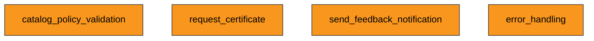

<!--
 Eclipse Tractus-X - Tractus-X TestLab

 Copyright (c) 2026 Catena-X Automotive Network e.V.
 Copyright (c) 2026 Contributors to the Eclipse Foundation

 Licensed under the Creative Commons Attribution 4.0 International License
 (the "License"); you may not use this file except in compliance with the
 License. You may obtain a copy of the License at

    https://creativecommons.org/licenses/by/4.0/

 Unless required by applicable law or agreed to in writing, software
 distributed under the License is distributed on an "AS IS" BASIS,
 WITHOUT WARRANTIES OR CONDITIONS OF ANY KIND, either express or implied.
 See the License for the specific language governing permissions and
 limitations under the License.

 SPDX-License-Identifier: CC-BY-4.0
-->
<!-- This documentation was partially generated using artificial intelligence (AI) (Tool: Copilot, Model: Claude Sonnet 4). -->
<!-- It was reviewed and tested by a human committer. -->

# CCM Conformity Testing

Run Certificate Credential Management (CCM) conformity tests against a System Under Test (SUT) to verify compliance with the Catena-X CX-0135 standard.

## What is CCM Conformity Testing?

The CX-0135 standard defines how Catena-X participants exchange company certificates (ISO 9001, IATF 16949, etc.) through EDC connectors using the CCMAPI. TestLab provides a ready-made test suite that validates whether your implementation handles the full certificate lifecycle correctly.

**Who should use this guide:**

- Developers implementing a CCMAPI-compliant service
- Quality engineers validating CX-0135 conformity before release
- Test architects adapting this suite as a template for other Catena-X standards

## CCM Test Suite Overview

The shipped suite (`docs/examples/certificate-management-v2/` in this repository) contains four independent tests:

| Test | Purpose |
|------|---------|
| `catalog_policy_validation` | Discover the CCMAPI offer and validate the CX-0135 catalog policy constraints |
| `request_certificate` | Query provider catalog, negotiate contract, POST certificate request, validate the payload against the BusinessPartnerCertificate schema |
| `send_feedback_notification` | Send feedback notification via EDC dataplane; await provider acknowledgment on a mock endpoint |
| `error_handling` | POST a request with an unknown certificate type and verify the rejection response |

### Test Flow



The tests are independent — none reads another test's outputs. When a suite does need ordering, tests declare `depends_on` and the player runs them in topological order.

## Test Suite Structure

### Index file and test references

The suite uses an `index.yaml` file that declares metadata, environment variables, and references individual test files. The shipped suite lives at `docs/examples/certificate-management-v2/raw/` in this repository:

```yaml
kind: tck
syntax: v1-alpha
id: certificate-management-tck-v0.0.1

metadata:
  name: "Certificate Management TCK"
  version: "v0.0.1"
  standards:
    - id: CX-0135
      version: v3.1.0

env:
  variables:
    - id: sut_counter_party_address
      uses: variable/type/string
      with:
        source: input   # supplied at execution time
        scope: sut      # the SUT operator provides it
      returns:
        value:
          type: string
  # ... schemas and testdata

tests:
  - id: request_certificate.yaml
    name: Request a certificate via CCMAPI
  - id: send_feedback_notification.yaml
    name: Send a feedback notification and await acknowledgment
```

Each `tests:` entry points to a YAML file with `kind: test`. Tests that read outputs published by earlier tests declare `depends_on`.

### Step types used in CCM

| Step Type | When to Use |
|-----------|-------------|
| `connector/consumer/query_catalog` | Discover assets in an EDC connector's catalog |
| `connector/consumer/extract_dataset` | Extract asset/offer IDs from a catalog response |
| `connector/consumer/negotiate` | Negotiate an EDC contract for an asset |
| `connector/consumer/initiate_transfer` | Get dataplane access credentials (EDR token) |
| `connector/consumer/pull_data_filtered` | Filtered catalog query, policy check, negotiation, and EDR retrieval in one step |
| `connector/dataplane/http_request` | Make HTTP requests to dataplane endpoints |
| `util/json_path_extract` | Extract values from JSON using a path expression |
| `mock/api` | Expose a temporary HTTP endpoint for callbacks |
| `mock/wait/http_request` | Block until a mock endpoint receives a request |
| `connector/provider/create_asset` | Register an asset in an EDC connector |
| `connector/provider/create_policy` | Create an access/contract policy |
| `connector/provider/create_contract_definition` | Link an asset to policies via a contract definition |
| `notification/consumer/send` | Send a CX notification through the EDC dataplane |
| `util/generate_uuid` | Generate a random UUID |

### Variable flow between steps

Variables flow through three mechanisms:

1. **Declared `returns:` outputs** — every step declares its outputs, and the engine publishes them into the run context automatically. Later steps reference them with `${{ }}` interpolation:

    ```yaml
    - id: pull_ccmapi_endpoint
      uses: connector/consumer/pull_data_filtered
      # ...
      returns:
        edr_token:
          type: string
        dataplane_url:
          type: string

    - id: request_certificate
      uses: connector/dataplane/http_request
      with:
        dataplane_url: "${{ execution.pull_ccmapi_endpoint.dataplane_url }}"
        edr_token: "${{ execution.pull_ccmapi_endpoint.edr_token }}"
    ```

2. **`store_in_variable`** — util steps (`util/json_path_extract`, `util/base64`, `util/parse_kv`) can capture their result into a named context variable for later reference.

3. **`depends_on`** — orders tests so that outputs published by a completed test are available in the shared run context when a dependent test runs.

### Assertions

Each step can include a `validate:` block. Validations are themselves step invocations (`validate/assert`, `validate/field`, `validate/schema`) that read the step's declared `returns:` outputs:

```yaml
validate:
  - uses: validate/field
    with: { input: status_code, operator: equals, value: 200 }
  - uses: validate/assert
    with: { input: edr_token, operator: not_null }
  - uses: validate/field
    with:
      input: response_body
      path: "header.messageId"
      operator: matches_regex
      value: "^urn:uuid:.*$"
  - uses: validate/schema
    with:
      input: response_body
      schema: "${{ env.schemas.certificate_schema }}"
```

### Infrastructure configuration

Tests never name their connector services — services are seeded at runtime from the manifest's `infrastructure:` declaration, and counter-party details arrive as `source: input` variables:

```yaml
infrastructure:
  engine:
    connector:
      required: true
      standard:
        id: CX-0018
        version: v4.2.0
  sut:
    connector:
      required: true
      standard:
        id: CX-0018
        version: v4.2.0
```

### Adapting for other standards

To create a test suite for a different Catena-X standard:

1. Copy `docs/examples/certificate-management-v2/raw/` (in this repository) to a new directory
2. Update `index.yaml`: change `name`, `standards`, and `variables`
3. Replace test files with steps matching your standard's API
4. Keep the same patterns: catalog query → negotiate → transfer → call → assert

## Understanding Test Results

### Exit codes

| Exit Code | Meaning |
|-----------|---------|
| `0` | All tests passed |
| `1` | One or more assertions failed |

### Reading results programmatically

The `TckResult` object contains the full execution tree:

```text
TckResult
├── status: COMPLETED | FAILED
├── scripts: list[ScriptResult]
│   ├── script_name: "request-certificate"
│   ├── status: COMPLETED | FAILED
│   ├── assertion_summary: {total, passed, failed_hard, failed_soft}
│   └── execution: list[StepResult]
│       ├── step_name: "POST certificate request"
│       ├── status: PASSED | FAILED | SKIPPED
│       ├── error: "Expected 200, got 403"
│       └── assertions: list[AssertionResult]
│           ├── passed: bool
│           ├── expected: 200
│           └── actual: 403
```

### Identifying failures

When a test fails, check these fields on each `StepResult`:

- **`step_name`** — which step failed (matches the `name` in YAML)
- **`step_type`** — what kind of step it was (`connector/dataplane/http_request`, `connector/consumer/negotiate`, etc.)
- **`error`** — human-readable error message
- **`assertions`** — list of individual assertion results with `expected` vs `actual`

## Integrating into Another Application

### Running tests programmatically

```python
import asyncio

import tractusx_testlab.steps  # registers all step executors
from tractusx_testlab.player.execution.player import TestlabPlayer

async def run_ccm_tests():
    player = TestlabPlayer()
    result = await player.run(
        "docs/examples/certificate-management-v2/raw/index.yaml",
        runtime_vars={
            "sut_counter_party_id": "BPNL000000000001",
            "sut_counter_party_address": "https://provider-edc.example.com/api/v1/dsp",
        },
    )

    # Check overall result
    print(f"Status: {result.status}")
    print(f"Steps passed: {result.passed}/{result.total}")

    # Inspect individual scripts
    for script in result.scripts:
        summary = script.assertion_summary
        print(f"  {script.script_name}: {script.status}")
        print(f"    Assertions: {summary.passed}/{summary.total} passed")

        # Show failures
        for step in script.execution:
            if step.error:
                print(f"    FAILED: {step.step_name} — {step.error}")

    # CI/CD exit code
    return 0 if result.status.value == "COMPLETED" else 1

exit_code = asyncio.run(run_ccm_tests())
raise SystemExit(exit_code)
```

### Validating without executing

Use the `Compiler` to validate test YAML syntax before running:

```python
from pathlib import Path
from tractusx_testlab.compiler.compiler import Compiler

compiler = Compiler()
result = compiler.validate(Path("docs/examples/certificate-management-v2/raw/index.yaml"))
print(f"Valid: {result.valid}")
```
