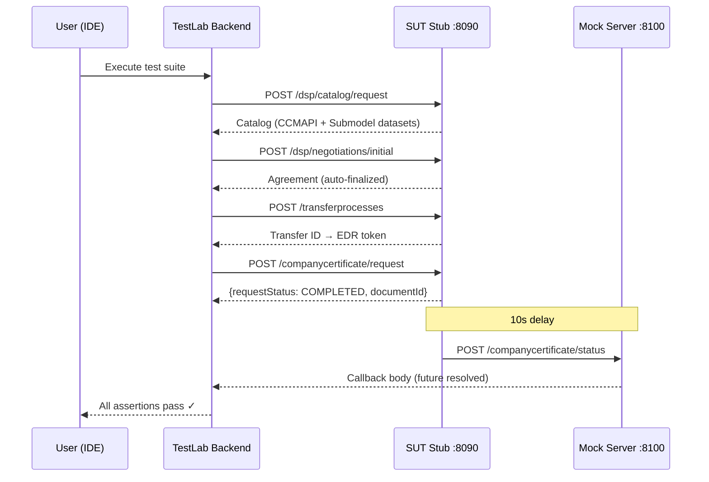
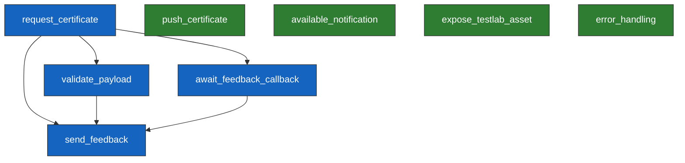

<!--
 Eclipse Tractus-X - Tractus-X TestLab

 Copyright (c) 2026 Contributors to the Eclipse Foundation

 See the NOTICE file(s) distributed with this work for additional
 information regarding copyright ownership.

 This program and the accompanying materials are made available under the
 terms of the Apache License, Version 2.0 which is available at
 https://www.apache.org/licenses/LICENSE-2.0.

 Unless required by applicable law or agreed to in writing, software
 distributed under the License is distributed on an "AS IS" BASIS, WITHOUT
 WARRANTIES OR CONDITIONS OF ANY KIND, either express or implied. See the
 License for the specific language governing permissions and limitations
 under the License.

 SPDX-License-Identifier: Apache-2.0
-->
<!-- This documentation was partially generated using artificial intelligence (AI) (Tool: Copilot, Model: Claude Opus 4.6). -->
<!-- It was reviewed and tested by a human committer. -->

# Company Certificate Management — Developer Guide

This guide covers setting up, running, and debugging the CX-0135 certificate management test suite against your CCMAPI implementation.

## Quick Start

### Prerequisites

- Python 3.12+
- A running CCMAPI-compliant SUT (or use the provided stub)
- Optionally the visual IDE from the separate [cx-test-suite](https://github.com/eclipse-tractusx/cx-test-suite) repository (requires Node.js 20+)

### Four steps to your first test run

```bash
# 1. Clone and install
git clone https://github.com/eclipse-tractusx/tractusx-testlab.git
cd tractusx-testlab
pip install -e .

# 2. Start the SUT stub
cd stubs/ccm-sut && uvicorn app:app --port 8090 &
cd ../..

# 3. Run the Certificate Management suite from the CLI
testlab run docs/examples/certificate-management-v2/raw/index.yaml --config run-config.yaml

# 4. (Optional) For visual authoring and execution monitoring, start the
#    TestLab backend with `testlab serve` and connect the cx-test-suite IDE to it.
```

## Running with the SUT Stub

The CCM SUT stub simulates an EDC connector and CCMAPI-compliant service in a single FastAPI application. You can run the full test suite locally without any real infrastructure.

### What the stub simulates

The stub at `stubs/ccm-sut/` replaces two real components:

- **EDC Connector** — DSP catalog, contract negotiation, transfer, and EDR endpoints
- **CCMAPI Service** — Certificate request, push, available, and notification endpoints

### E2E flow with the stub



### Run-config variables

| Variable | Stub Value | Purpose |
|----------|-----------|--------|
| `provider_address` | `http://localhost:8090/api/v1/dsp` | Stub's DSP endpoint |
| `provider_bpn` | `BPNL000000000001` | Stub's BPN |
| `consumer_bpn` | `BPNL000000000002` | TestLab's BPN |
| `certificate_type` | `iso9001` | Certificate to request |
| `location_bpns` | `BPNS000000000001` | Site needing the certificate |
| `testlab_mock_base_url` | `http://localhost:8100` | Callback target for the stub |
| `testlab_management_url` | `http://localhost:8090/api/v1/dsp` | TestLab EDC management |
| `testlab_dsp_url` | `http://localhost:8090/api/v1/dsp` | TestLab DSP endpoint |
| `sut_response_timeout` | `60` | Seconds to wait for callbacks |

### Switching to a real SUT

Replace `provider_address` with your EDC's DSP URL and update the BPN values. All other test logic remains unchanged — the test suite is SUT-agnostic.

## How the Test Suite Works

### Index file structure

The TCK manifest at `index.yaml` declares metadata, environment variables, and test references (see the shipped suite at `docs/examples/certificate-management-v2/raw/index.yaml`):

```yaml
kind: tck
syntax: v1-alpha
id: certificate-management-tck-v0.0.1

metadata:
  name: "Certificate Management TCK"
  version: "v0.0.1"
  standards:
    - id: CX-0135
      version: v3.1.0

env:
  variables:
    - id: sut_counter_party_address
      uses: variable/type/string
      with:
        source: input   # supplied at execution time
        scope: sut      # the SUT operator provides it
      returns:
        value:
          type: string

tests:
  - id: request_certificate.yaml
    name: Request a certificate via CCMAPI
  # ... more tests
```

### Test files and dependencies

The full suite described in this guide contains 8 test files; the engine repository ships a four-test version at `docs/examples/certificate-management-v2/raw/tests/`. Some tests depend on outputs from earlier tests:



**Blue tests** form a dependency chain (must run in order). **Green tests** are independent and can run in parallel.

| Test | CX-0135 Section | Dependencies |
|------|-----------------|--------------|
| `request_certificate` | §2.1.1.1 | None |
| `validate_payload` | §3.1 | `request_certificate` (reads its `document_id` output) |
| `await_feedback_callback` | §2.1.1.3 | `request_certificate` (reads its `request_id` output) |
| `send_feedback` | §2.1.1.3 | `request_certificate`, `validate_payload`, `await_feedback_callback` |
| `push_certificate` | §2.1.1.2 | None |
| `available_notification` | §2.1.1.4 | None |
| `expose_testlab_asset` | §2.1.4.1 | None |
| `error_handling` | §2.1.1.1.4 | None |

## Execution Flow

See the **[Architecture Guide](ccm-architecture-guide.md)** for the full internal sequence. In summary:

1. The IDE (cx-test-suite) converts the workspace to YAML and sends `POST /testlab/test-execution/run`
2. The backend parses YAML into a `Tck` object and topologically sorts scripts by dependencies
3. For each script: resolve `${{ }}` references → execute steps → evaluate `validate:` assertions → publish declared `returns:` outputs
4. The IDE receives real-time SSE events (`step.started`, `step.completed`, `step.failed`)

## Deep Dive: request_certificate

This test executes the full DSP + CCMAPI flow in 7 steps:

| Step | Type | What It Does |
|------|------|-------------|
| 1 | `connector/consumer/query_catalog` | DSP catalog request filtered for `cx-taxo:CCMAPI` |
| 2–3 | `util/json_path_extract` | Extract asset ID and offer policy from catalog |
| 4 | `connector/consumer/negotiate` | DSP contract negotiation for the CCMAPI asset |
| 5 | `connector/consumer/initiate_transfer` | Get an EDR with data plane auth token |
| 6 | `util/generate_uuid` | Create a unique `messageId` |
| 7 | `connector/dataplane/http_request` | POST CX-0135 envelope to `/companycertificate/request` |

Steps 1–5 can also be collapsed into a single `connector/consumer/pull_data_filtered` step, which is what the shipped suite does. The final step sends a CX-0135 `{header, content}` envelope and asserts a 200 response with non-null `requestStatus` and `documentId`. It publishes `request_id` and `document_id` as declared outputs for downstream tests.

## Configuring for Your SUT

Create a `run-config.yaml` with your environment's values:

```yaml
variables:
  provider_address: "https://your-edc:8282/api/v1/dsp"
  provider_bpn: "BPNL00000003AZQP"
  consumer_bpn: "BPNL00000001SQRN"
  certificate_type: "iso9001"
  location_bpns: "BPNS000000000001"
  testlab_management_url: "https://testlab-edc:8282/management"
  testlab_dsp_url: "https://testlab-edc:8282/api/v1/dsp"
  testlab_mock_base_url: "http://testlab-host:8100"
  sut_response_timeout: 300
```

Run from CLI:

```bash
testlab run path/to/index.yaml --config run-config.yaml
```

## Debugging Failures

### Common failures and fixes

| Symptom | Cause | Fix |
|---------|-------|-----|
| "Catalog query returned no datasets" | SUT doesn't advertise a CCMAPI asset | Register an asset with `dct:type = cx-taxo:CCMAPI` in your EDC |
| "Negotiate returned None" | EDC management API path mismatch | Verify your DSP endpoint path matches `provider_address` |
| "Schema validation failed" | Certificate payload missing required fields | Compare your response against the BusinessPartnerCertificate v3.1.0 schema |
| "Timed out waiting for callback" | SUT not sending HTTP callbacks | Verify your system POSTs to the `senderFeedbackUrl` from the request header |
| "Status code 403" | EDC access policy rejected the consumer BPN | Add the test `consumer_bpn` to your connector's access policies |

### Reading logs

Test execution logs are written to the `logs/` directory with timestamps. Each step logs its request, response, and assertion results.

### Adding debug assertions

Add extra `validate:` entries to any step to inspect intermediate values, or a `util/log` step to print a value to the execution log:

```yaml
validate:
  - uses: validate/field
    with:
      input: response_body
      path: "header.messageId"
      operator: not_null
```

## Extending the Suite

### Add a new test step

1. Create a new YAML file in the `tests/` directory
2. Define `kind: test`, metadata, and `execution:` steps (`uses:` / `with:` / `returns:` / `validate:`)
3. Add a reference in `index.yaml` under `tests:`
4. Declare `depends_on` if the test reads outputs published by other tests

### Add a new certificate type test

Duplicate `request_certificate.yaml` and change `certificate_type` from `"iso9001"` to your target type (e.g., `"iatf16949"`, `"iso14001"`).

## Next Steps

- **[Business Guide](ccm-business-guide.md)** — Non-technical overview of what the tests validate
- **[Architecture Guide](ccm-architecture-guide.md)** — System design, callback patterns, and extension points
- **[CCM Conformity Testing](ccm-conformity-testing.md)** — Detailed test reference
