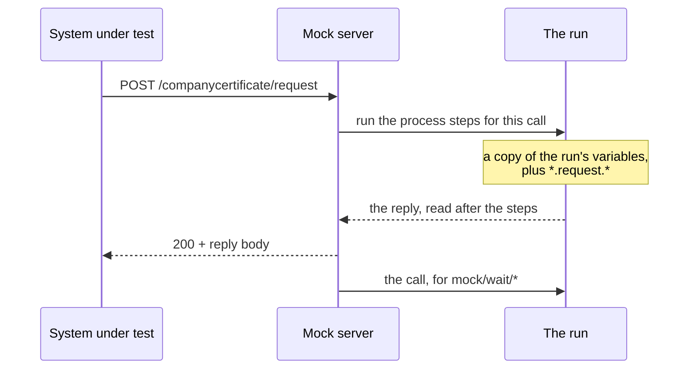

<!--
 Eclipse Tractus-X - Tractus-X TestLab

 Copyright (c) 2026 Contributors to the Eclipse Foundation

 See the NOTICE file(s) distributed with this work for additional
 information regarding copyright ownership.

 This program and the accompanying materials are made available under the
 terms of the Apache License, Version 2.0 which is available at
 https://www.apache.org/licenses/LICENSE-2.0.

 Unless required by applicable law or agreed to in writing, software
 distributed under the License is distributed on an "AS IS" BASIS, WITHOUT
 WARRANTIES OR CONDITIONS OF ANY KIND, either express or implied. See the
 License for the specific language governing permissions and limitations
 under the License.

 SPDX-License-Identifier: Apache-2.0
-->
<!-- This documentation was partially generated using artificial intelligence (AI) (Tool: Claude Code, Model: Claude Opus 5.5). -->
<!-- It was reviewed and tested by a human committer. -->

# Answer a call from what it carried

`mock/api` answers every call with the same canned reply. That is enough when the reply does not matter, and wrong when the protocol says the reply depends on the request: a certificate request is answered with the request's `messageId` as `relatedMessageId`, with sender and receiver swapped, and with `COMPLETED` or `REJECTED` depending on what was asked for.

`labs/mock/api/dynamic` is a mock that runs steps for every call first, and reads its reply after them. This tutorial builds one for the CX-0135 certificate request.

!!! warning "Experimental"
    The step is under `labs/`. Enable the extension in the manifest (`extensions: [labs]`) to use it. Its contract may change before it moves out of `labs`.

## How a call is answered



- **One call, one context.** Each call runs the mock's `process:` on a copy of the run's variables. Two calls answered at once never see each other's values, and nothing the steps publish reaches the rest of the test.
- **One reply.** `response_status`, `response_body` and `response_headers` are read once, after the last step. There is no step that sends a reply, so a call can never be answered twice.
- **The steps run on the run's event loop.** They reach the run's connectors and services exactly as its other steps do.
- **The call still reaches `mock/wait/*`.** It is handed to the listener once the reply is worked out, as `mock/api` does.

## The references a dynamic mock reads

Everything that belongs to one call is written with a `*.` in front — see [call-scoped references](../tck-syntax/steps/expressions.md#call-scoped-references-labs):

| Reference | What it is |
|---|---|
| `${{ *.request.body }}` | The body the caller sent |
| `${{ *.request.headers }}`, `${{ *.request.query }}` | Its headers (lower-case names) and query string |
| `${{ *.request.method }}`, `${{ *.request.path }}` | Its method and path |
| `${{ *.process.<id>.<field> }}` | What one of the mock's own steps returned, for this call |

A call-scoped reference may continue into the value it names: `${{ *.request.body.header.messageId }}`. No extraction step is needed for a field of the request.

## Build the certificate-request mock

The engine plays the Certificate Provider. The system under test posts a certificate request (CX-0135 §2.1.1.1), and the mock answers with the §2.1.1.1.3 or §2.1.1.1.4 response body.

```yaml
setup:
  - id: request_backend
    uses: labs/mock/api/dynamic
    name: Answer certificate requests like a Certificate Provider
    with:
      method: POST
      path: /companycertificate/request
      process:
        # A fresh messageId and the time, for the reply's header.
        - id: answer_id
          uses: util/generate_uuid
          returns:
            value: { type: string }
        - id: sent_at
          uses: labs/util/now
          returns:
            value: { type: string }

        # The header, built once from the request: sender and receiver
        # swapped, relatedMessageId the request's own messageId.
        - id: answer_header
          uses: util/log
          with:
            value:
              context: CompanyCertificateManagement-CCMAPI-Request:1.0.0
              messageId: "urn:uuid:${{ *.process.answer_id.value }}"
              sentDateTime: "${{ *.process.sent_at.value }}"
              senderBpn: "${{ *.request.body.header.receiverBpn }}"
              receiverBpn: "${{ *.request.body.header.senderBpn }}"
              relatedMessageId: "${{ *.request.body.header.messageId }}"
          returns:
            value: { type: object }

        # COMPLETED for a certificate type the engine holds, REJECTED
        # otherwise. Both branches publish under the same id, and only one
        # of them runs, so the reply reads *.process.answer either way.
        - id: pick_answer
          uses: flow/if
          with:
            conditions:
              - input: "${{ *.request.body }}"
                path: content.certificateType
                operator: one_of
                value: [iso9001, iatf16949]
            then:
              - id: answer
                uses: util/log
                with:
                  value:
                    header: "${{ *.process.answer_header.value }}"
                    content:
                      requestStatus: COMPLETED
                      documentId: "${{ env.certificate_asset_id }}"
                returns:
                  value: { type: object }
            else:
              - id: answer
                uses: util/log
                with:
                  value:
                    header: "${{ *.process.answer_header.value }}"
                    content:
                      requestStatus: REJECTED
                      requestErrors:
                        - message: "No certificate of this type is held for the requested BPN."
                returns:
                  value: { type: object }

      # Read once, after the steps above have run for this call.
      response_status: 200
      response_body: "${{ *.process.answer.value }}"
    returns:
      mock:
        type: class
        class: MockInstance
```

What to notice:

- **`returns:` is what publishes.** A `process:` step publishes only the keys its `returns:` declares, exactly as a top-level step does. Leave it out and `${{ *.process.<id>.value }}` names nothing.
- **The reply is one reference.** `response_body: "${{ *.process.answer.value }}"` sends the object the branch built, type intact. A structure with references inside it works too, and may mix call-scoped references with ordinary ones such as `${{ env.certificate_asset_id }}`.
- **The branch is a plain `flow/if`.** There is no new syntax for choosing a reply: a step in each branch publishes under the same id.
- **The status can be worked out too.** `response_status: "${{ *.process.status.value }}"` reads a status a step returned.

Offer the mock through the engine connector with `connector/provider/create_mock_asset`, as any other mock, and wait for the call with `mock/wait/dataplane/http_request` or `mock/wait/http_request`.

## When no reply can be worked out

The mock answers **500** with a fixed body, `{"detail": "The mock could not work out its reply to this call."}`, and logs why at warning level, when:

- a `process:` step fails — it raised, or one of its `validate:` checks failed;
- the reply names something that is not there, for example a field the request did not carry;
- the steps take longer than `process_timeout` (10 s by default);
- the run that registered the mock has already ended.

The reason is never sent to the caller: it names the test's variables, and the caller is the system under test. The test itself does not fail on it; the call still reaches `mock/wait/*`, and a check there decides.

## Keep `process` short

The caller waits for the reply while the steps run. When the caller is a connector's data plane, it forwards a call from the system under test, and both have timeouts of their own, usually well under a minute. A `process` that extracts, branches and builds a body finishes in milliseconds. A `process` that calls another service adds that service's latency to every reply, so raise `process_timeout` only as far as the slowest caller in the chain allows.
